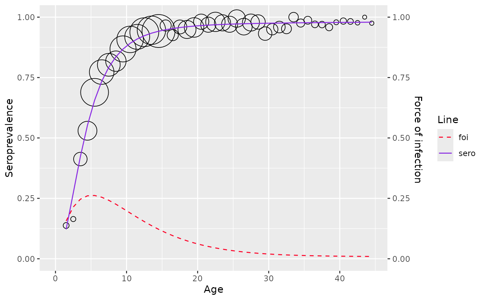

# Hierarchical Bayesian models

``` r
library(serosv)
```

## Parametric Bayesian framework

Currently, `serosv` only has models under parametric Bayesian framework

**Proposed approach**

Prevalence has a parametric form $`\pi(a_i, \alpha)`$ where $`\alpha`$
is a parameter vector

One can constraint the parameter space of the prior distribution
$`P(\alpha)`$ in order to achieve the desired monotonicity of the
posterior distribution $`P(\pi_1, \pi_2, ..., \pi_m|y,n)`$

Where:

- $`n = (n_1, n_2, ..., n_m)`$ and $`n_i`$ is the sample size at age
  $`a_i`$

- $`y = (y_1, y_2, ..., y_m)`$ and $`y_i`$ is the number of infected
  individual from the $`n_i`$ sampled subjects

### Farrington

Refer to `Chapter 10.3.1`

**Proposed model**

The model for prevalence is as followed

``` math

\pi (a) = 1 - exp\{ \frac{\alpha_1}{\alpha_2}ae^{-\alpha_2 a} + \frac{1}{\alpha_2}(\frac{\alpha_1}{\alpha_2} - \alpha_3)(e^{-\alpha_2 a} - 1) -\alpha_3 a \}
```

For likelihood model, independent binomial distribution are assumed for
the number of infected individuals at age $`a_i`$

``` math

y_i \sim Bin(n_i, \pi_i), \text{  for } i = 1,2,3,...m
```

The constraint on the parameter space can be incorporated by assuming
truncated normal distribution for the components of $`\alpha`$,
$`\alpha = (\alpha_1, \alpha_2, \alpha_3)`$ in
$`\pi_i = \pi(a_i,\alpha)`$

``` math

\alpha_j \sim \text{truncated  } \mathcal{N}(\mu_j, \tau_j), \text{ } j = 1,2,3
```

The joint posterior distribution for $`\alpha`$ can be derived by
combining the likelihood and prior as followed

``` math

P(\alpha|y) \propto \prod^m_{i=1} \text{Bin}(y_i|n_i, \pi(a_i, \alpha)) \prod^3_{i=1}-\frac{1}{\tau_j}\text{exp}(\frac{1}{2\tau^2_j} (\alpha_j - \mu_j)^2)
```

- Where the flat hyperprior distribution is defined as followed:

  - $`\mu_j \sim \mathcal{N}(0, 10000)`$

  - $`\tau^{-2}_j \sim \Gamma(100,100)`$

The full conditional distribution of $`\alpha_i`$ is thus
``` math

P(\alpha_i|\alpha_j,\alpha_k, k, j \neq i) \propto  -\frac{1}{\tau_i}\text{exp}(\frac{1}{2\tau^2_i} (\alpha_i - \mu_i)^2) \prod^m_{i=1} \text{Bin}(y_i|n_i, \pi(a_i, \alpha))
```

**Fitting data**

To fit Farrington model, use
[`hierarchical_bayesian_model()`](https://oucru-modelling.github.io/serosv/reference/hierarchical_bayesian_model.md)
and define `type = "far2"` or `type = "far3"` where

- `type = "far2"` refers to Farrington model with 2 parameters
  ($`\alpha_3 = 0`$)

- `type = "far3"` refers to Farrington model with 3 parameters
  ($`\alpha_3 > 0`$)

``` r
df <- mumps_uk_1986_1987
model <- hierarchical_bayesian_model(df, type="far3")
#> 
#> SAMPLING FOR MODEL 'fra_3' NOW (CHAIN 1).
#> Chain 1: Rejecting initial value:
#> Chain 1:   Log probability evaluates to log(0), i.e. negative infinity.
#> Chain 1:   Stan can't start sampling from this initial value.
#> Chain 1: 
#> Chain 1: Gradient evaluation took 0.000154 seconds
#> Chain 1: 1000 transitions using 10 leapfrog steps per transition would take 1.54 seconds.
#> Chain 1: Adjust your expectations accordingly!
#> Chain 1: 
#> Chain 1: 
#> Chain 1: Iteration:    1 / 5000 [  0%]  (Warmup)
#> Chain 1: Iteration:  500 / 5000 [ 10%]  (Warmup)
#> Chain 1: Iteration: 1000 / 5000 [ 20%]  (Warmup)
#> Chain 1: Iteration: 1500 / 5000 [ 30%]  (Warmup)
#> Chain 1: Iteration: 1501 / 5000 [ 30%]  (Sampling)
#> Chain 1: Iteration: 2000 / 5000 [ 40%]  (Sampling)
#> Chain 1: Iteration: 2500 / 5000 [ 50%]  (Sampling)
#> Chain 1: Iteration: 3000 / 5000 [ 60%]  (Sampling)
#> Chain 1: Iteration: 3500 / 5000 [ 70%]  (Sampling)
#> Chain 1: Iteration: 4000 / 5000 [ 80%]  (Sampling)
#> Chain 1: Iteration: 4500 / 5000 [ 90%]  (Sampling)
#> Chain 1: Iteration: 5000 / 5000 [100%]  (Sampling)
#> Chain 1: 
#> Chain 1:  Elapsed Time: 16.591 seconds (Warm-up)
#> Chain 1:                96.031 seconds (Sampling)
#> Chain 1:                112.622 seconds (Total)
#> Chain 1:
#> Warning: There were 288 divergent transitions after warmup. See
#> https://mc-stan.org/misc/warnings.html#divergent-transitions-after-warmup
#> to find out why this is a problem and how to eliminate them.
#> Warning: There were 11 transitions after warmup that exceeded the maximum treedepth. Increase max_treedepth above 10. See
#> https://mc-stan.org/misc/warnings.html#maximum-treedepth-exceeded
#> Warning: Examine the pairs() plot to diagnose sampling problems
#> Warning: Tail Effective Samples Size (ESS) is too low, indicating posterior variances and tail quantiles may be unreliable.
#> Running the chains for more iterations may help. See
#> https://mc-stan.org/misc/warnings.html#tail-ess

model$info
#>                       mean      se_mean           sd          2.5%
#> alpha1        1.396732e-01 2.328172e-04 5.926643e-03  1.290067e-01
#> alpha2        1.989632e-01 3.342249e-04 8.454176e-03  1.847781e-01
#> alpha3        9.017286e-03 2.957517e-04 7.503320e-03  2.519932e-04
#> tau_alpha1    2.051039e+00 2.925237e-01 5.992958e+00  1.814318e-06
#> tau_alpha2    4.280878e+00 1.545375e+00 1.261621e+01  5.514011e-06
#> tau_alpha3    1.594944e+00 2.713658e-01 4.513571e+00  1.717967e-06
#> mu_alpha1    -2.434489e+00 4.143249e+00 4.467754e+01 -1.656101e+02
#> mu_alpha2    -9.043922e-01 1.406475e+00 3.373188e+01 -9.031034e+01
#> mu_alpha3     2.147579e+00 1.666808e+00 4.272829e+01 -9.818932e+01
#> sigma_alpha1  9.673678e+03 9.523462e+03 2.012224e+05  2.027127e-01
#> sigma_alpha2  8.037575e+01 1.664371e+01 5.816331e+02  1.342710e-01
#> sigma_alpha3  1.665419e+02 4.235920e+01 1.470059e+03  2.354869e-01
#> lp__         -2.534311e+03 2.684310e-01 4.176499e+00 -2.542650e+03
#>                        25%           50%           75%         97.5%      n_eff
#> alpha1        1.353546e-01  1.393536e-01  1.435425e-01  1.520502e-01  648.01829
#> alpha2        1.931939e-01  1.981250e-01  2.037919e-01  2.181404e-01  639.83066
#> alpha3        3.301399e-03  6.948630e-03  1.310897e-02  2.798314e-02  643.65402
#> tau_alpha1    4.699710e-04  1.339575e-02  4.377299e-01  2.433537e+01  419.72073
#> tau_alpha2    1.099782e-03  3.547442e-02  9.730938e-01  5.546799e+01   66.64842
#> tau_alpha3    3.847899e-04  1.424805e-02  4.511886e-01  1.803311e+01  276.64990
#> mu_alpha1    -4.777740e+00  1.761566e-01  4.990839e+00  8.616947e+01  116.27771
#> mu_alpha2    -3.043304e+00  1.912986e-01  2.809284e+00  6.930927e+01  575.19790
#> mu_alpha3    -4.356601e+00  8.834931e-02  7.109717e+00  1.097394e+02  657.14323
#> sigma_alpha1  1.511461e+00  8.640059e+00  4.612799e+01  7.424105e+02  446.43988
#> sigma_alpha2  1.013731e+00  5.309408e+00  3.015428e+01  4.258861e+02 1221.23065
#> sigma_alpha3  1.488748e+00  8.377652e+00  5.097869e+01  7.629637e+02 1204.40906
#> lp__         -2.537035e+03 -2.534291e+03 -2.531361e+03 -2.526569e+03  242.08025
#>                   Rhat
#> alpha1       1.0006390
#> alpha2       0.9997486
#> alpha3       0.9999655
#> tau_alpha1   1.0023789
#> tau_alpha2   1.0060590
#> tau_alpha3   1.0005442
#> mu_alpha1    1.0039620
#> mu_alpha2    0.9997144
#> mu_alpha3    1.0015442
#> sigma_alpha1 1.0019918
#> sigma_alpha2 1.0000931
#> sigma_alpha3 0.9997146
#> lp__         1.0215691
plot(model)
```



### Log-logistic

**Proposed approach**

The model for seroprevalence is as followed

``` math

\pi(a) = \frac{\beta a^\alpha}{1 + \beta a^\alpha}, \text{ } \alpha, \beta > 0
```

The likelihood is specified to be the same as Farrington model
($`y_i \sim Bin(n_i, \pi_i)`$) with

``` math

\text{logit}(\pi(a)) = \alpha_2 + \alpha_1\log(a)
```

- Where $`\alpha_2 = \text{log}(\beta)`$

The prior model of $`\alpha_1`$ is specified as
$`\alpha_1 \sim \text{truncated  } \mathcal{N}(\mu_1, \tau_1)`$ with
flat hyperprior as in Farrington model

$`\beta`$ is constrained to be positive by specifying
$`\alpha_2 \sim \mathcal{N}(\mu_2, \tau_2)`$

The full conditional distribution of $`\alpha_1`$ is thus

``` math

P(\alpha_1|\alpha_2) \propto -\frac{1}{\tau_1} \text{exp} (\frac{1}{2 \tau_1^2} (\alpha_1 - \mu_1)^2)
\prod_{i=1}^m \text{Bin}(y_i|n_i,\pi(a_i, \alpha_1, \alpha_2) )
```

And $`\alpha_2`$ can be derived in the same way

**Fitting data**

To fit Log-logistic model, use
[`hierarchical_bayesian_model()`](https://oucru-modelling.github.io/serosv/reference/hierarchical_bayesian_model.md)
and define `type = "log_logistic"`

``` r
df <- rubella_uk_1986_1987
model <- hierarchical_bayesian_model(df, type="log_logistic")
#> 
#> SAMPLING FOR MODEL 'log_logistic' NOW (CHAIN 1).
#> Chain 1: 
#> Chain 1: Gradient evaluation took 6.4e-05 seconds
#> Chain 1: 1000 transitions using 10 leapfrog steps per transition would take 0.64 seconds.
#> Chain 1: Adjust your expectations accordingly!
#> Chain 1: 
#> Chain 1: 
#> Chain 1: Iteration:    1 / 5000 [  0%]  (Warmup)
#> Chain 1: Iteration:  500 / 5000 [ 10%]  (Warmup)
#> Chain 1: Iteration: 1000 / 5000 [ 20%]  (Warmup)
#> Chain 1: Iteration: 1500 / 5000 [ 30%]  (Warmup)
#> Chain 1: Iteration: 1501 / 5000 [ 30%]  (Sampling)
#> Chain 1: Iteration: 2000 / 5000 [ 40%]  (Sampling)
#> Chain 1: Iteration: 2500 / 5000 [ 50%]  (Sampling)
#> Chain 1: Iteration: 3000 / 5000 [ 60%]  (Sampling)
#> Chain 1: Iteration: 3500 / 5000 [ 70%]  (Sampling)
#> Chain 1: Iteration: 4000 / 5000 [ 80%]  (Sampling)
#> Chain 1: Iteration: 4500 / 5000 [ 90%]  (Sampling)
#> Chain 1: Iteration: 5000 / 5000 [100%]  (Sampling)
#> Chain 1: 
#> Chain 1:  Elapsed Time: 4.15 seconds (Warm-up)
#> Chain 1:                5.77 seconds (Sampling)
#> Chain 1:                9.92 seconds (Total)
#> Chain 1:
#> Warning: There were 583 divergent transitions after warmup. See
#> https://mc-stan.org/misc/warnings.html#divergent-transitions-after-warmup
#> to find out why this is a problem and how to eliminate them.
#> Warning: Examine the pairs() plot to diagnose sampling problems
#> Warning: Bulk Effective Samples Size (ESS) is too low, indicating posterior means and medians may be unreliable.
#> Running the chains for more iterations may help. See
#> https://mc-stan.org/misc/warnings.html#bulk-ess
#> Warning: Tail Effective Samples Size (ESS) is too low, indicating posterior variances and tail quantiles may be unreliable.
#> Running the chains for more iterations may help. See
#> https://mc-stan.org/misc/warnings.html#tail-ess

model$type
#> [1] "log_logistic"
plot(model)
```


