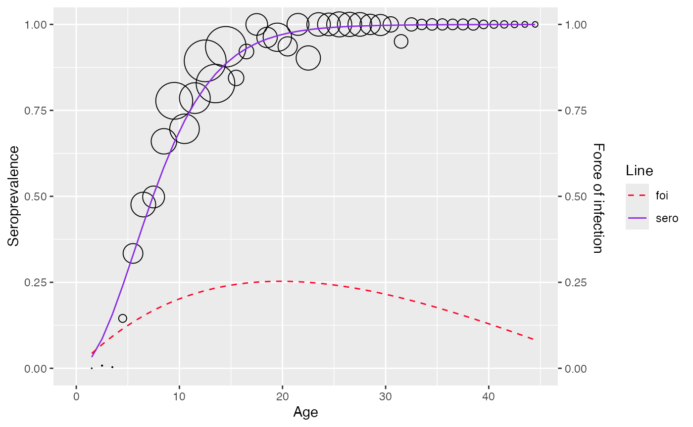

# Imperfect serological test

``` r
library(serosv)
library(ggplot2)
#> Warning: package 'ggplot2' was built under R version 4.3.3
```

## Imperfect test

Function
[`correct_prevalence()`](https://oucru-modelling.github.io/serosv/reference/correct_prevalence.md)
is used for estimating the true prevalence if the serological test used
is imperfect

Arguments:

- `data` the input data frame, must either have:

  - `age`, `pos`, `tot` columns (for aggregated data)

  - **OR** `age`, `status` columns for (linelisting data)

- `bayesian` whether to adjust sero-prevalence using the Bayesian or
  frequentist approach. If set to `TRUE`, true sero-prevalence is
  estimated using MCMC.

- `init_se` sensitivity of the serological test (default value `0.95`)

- `init_sp` specificity of the serological test (default value `0.8`)

- `study_size_se` (applicable when `bayesian=TRUE`) sample size for
  sensitivity validation study (default value `1000`)

- `study_size_sp` (applicable when `bayesian=TRUE`) sample size for
  specificity validation study (default value `1000`)

- `chains` (applicable when `bayesian=TRUE`) number of Markov chains
  (default to `1`)

- `warmup` (applicable when `bayesian=TRUE`) number of warm up runs
  (default value `1000`)

- `iter` (applicable when `bayesian=TRUE`) number of iterations (default
  value `2000`)

The function will return a list of 2 items:

- `info`

  - if `bayesian = TRUE` contains estimated values for se, sp and
    corrected seroprevalence

  - else return the formula for computing corrected seroprevalence

- `corrected_sero` return a data.frame with `age`, `sero` (corrected
  sero) and `pos`, `tot` (adjusted based on corrected prevalence)

``` r
# ---- estimate real prevalence using Bayesian approach ----
data <- rubella_uk_1986_1987
output <- correct_prevalence(data, warmup = 1000, iter = 4000, init_se=0.9, init_sp = 0.8, study_size_se=1000, study_size_sp=3000)
#> 
#> SAMPLING FOR MODEL 'prevalence_correction' NOW (CHAIN 1).
#> Chain 1: 
#> Chain 1: Gradient evaluation took 9.6e-05 seconds
#> Chain 1: 1000 transitions using 10 leapfrog steps per transition would take 0.96 seconds.
#> Chain 1: Adjust your expectations accordingly!
#> Chain 1: 
#> Chain 1: 
#> Chain 1: Iteration:    1 / 4000 [  0%]  (Warmup)
#> Chain 1: Iteration:  400 / 4000 [ 10%]  (Warmup)
#> Chain 1: Iteration:  800 / 4000 [ 20%]  (Warmup)
#> Chain 1: Iteration: 1001 / 4000 [ 25%]  (Sampling)
#> Chain 1: Iteration: 1400 / 4000 [ 35%]  (Sampling)
#> Chain 1: Iteration: 1800 / 4000 [ 45%]  (Sampling)
#> Chain 1: Iteration: 2200 / 4000 [ 55%]  (Sampling)
#> Chain 1: Iteration: 2600 / 4000 [ 65%]  (Sampling)
#> Chain 1: Iteration: 3000 / 4000 [ 75%]  (Sampling)
#> Chain 1: Iteration: 3400 / 4000 [ 85%]  (Sampling)
#> Chain 1: Iteration: 3800 / 4000 [ 95%]  (Sampling)
#> Chain 1: Iteration: 4000 / 4000 [100%]  (Sampling)
#> Chain 1: 
#> Chain 1:  Elapsed Time: 2.026 seconds (Warm-up)
#> Chain 1:                4.044 seconds (Sampling)
#> Chain 1:                6.07 seconds (Total)
#> Chain 1:

# check fitted value 
output$info[1:2, ]
#>             mean      se_mean          sd      2.5%       25%       50%
#> est_se 0.9278179 0.0001098350 0.006095913 0.9151759 0.9239329 0.9279511
#> est_sp 0.8028005 0.0001011728 0.006973970 0.7888135 0.7981642 0.8028934
#>              75%     97.5%    n_eff      Rhat
#> est_se 0.9318726 0.9390499 3080.323 0.9998417
#> est_sp 0.8075049 0.8167427 4751.518 0.9996668

# ---- estimate real prevalence using frequentist approach ----
freq_output <- correct_prevalence(data, bayesian = FALSE, init_se=0.9, init_sp = 0.8)

# check info
freq_output$info
#> [1] "Formula: real_sero = (observed_sero + sp - 1) / (se + sp -1)"
```

User can then visualize the output using
[`plot_corrected_prev()`](https://oucru-modelling.github.io/serosv/reference/plot_corrected_prev.md)
function

``` r
# Plot output of the frequentist approach
plot_corrected_prev(freq_output)
```


``` r

# Plot output of the bayesian approach 
plot_corrected_prev(output)
```

 To compare
both correction methods in a single plot, provide the output from the
second method as the optional `y` argument in
[`plot_corrected_prev()`](https://oucru-modelling.github.io/serosv/reference/plot_corrected_prev.md)

``` r
plot_corrected_prev(output, freq_output)
```


``` r

# set facet = TRUE to display the confidence or credible intervals for each method
plot_corrected_prev(output, freq_output, facet = TRUE)
```


### Fitting corrected data

**Data after seroprevalence correction**

Bayesian approach

``` r
suppressWarnings(
  corrected_data <- farrington_model(
  output$corrected_se,
  start=list(alpha=0.07,beta=0.1,gamma=0.03))
)

plot(corrected_data)
#> Warning: No shared levels found between `names(values)` of the manual scale and the
#> data's fill values.
```



Frequentist approach

``` r
suppressWarnings(
  corrected_data <- farrington_model(
  freq_output$corrected_se,
  start=list(alpha=0.07,beta=0.1,gamma=0.03))
)

plot(corrected_data)
#> Warning: No shared levels found between `names(values)` of the manual scale and the
#> data's fill values.
```


**Original data**

``` r
suppressWarnings(
  original_data <- farrington_model(
  data,
  start=list(alpha=0.07,beta=0.1,gamma=0.03))
)
plot(original_data)
#> Warning: No shared levels found between `names(values)` of the manual scale and the
#> data's fill values.
```


