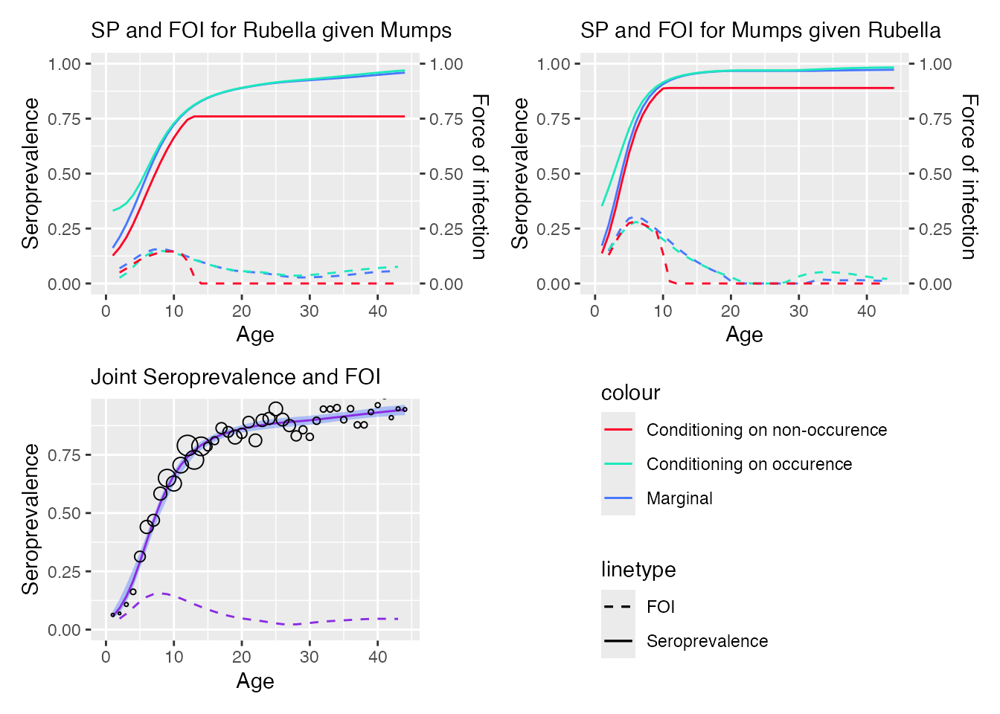

# Model multivariate serological data

``` r
library(serosv)
#> Warning: replacing previous import 'mgcv::s' by 'VGAM::s' when loading 'serosv'
```

## Bivariate Dale model

Fitting bivariate Dale model using
[`bivariate_dale_model()`](https://oucru-modelling.github.io/serosv/reference/bivariate_dale_model.md)

We will use `rubella_mumps_uk` data for this example

``` r
data <- rubella_mumps_uk
model <- bivariate_dale_model(age = data$age, y = data[, c("NN", "NP", "PN", "PP")], monotonized=TRUE)
```

plot function for `bivariate_dale_model` object takes 3 additional
parameters:

- `y1` and `y2` are labels for 2 diseases being modeled

- `plot_type` is for the type of plot being returned

  - `"ci"` returns fitted line for marginal prevalence and its 95%
    confidence interval

  - `"sp"` returns conditional and joint seroprevalence and FOI

  - other inputs would returns all individual plots

``` r
plot(model, y1 = "Rubella", y2 = "Mumps", plot_type = "sp")
```



For line listing data `vzv_parvo_be` , use
[`generate_quad_matrix()`](https://oucru-modelling.github.io/serosv/reference/generate_quad_matrix.md)
function to create the (NN, NP, PN, PP) for fitting the model

``` r
generate_quad_matrix(vzv_parvo_be, vzv_res, parvo_res, age, discrete_age = F)
#> # A tibble: 1,751 × 6
#>       age    NN    NP    PN    PP total
#>     <dbl> <int> <int> <int> <int> <int>
#>  1 0.0329     0     0     1     0     1
#>  2 0.0521     1     0     0     0     1
#>  3 0.266      0     0     1     0     1
#>  4 0.403      1     0     0     0     1
#>  5 0.493      0     0     0     1     1
#>  6 0.663      1     0     0     0     1
#>  7 0.811      1     0     0     0     1
#>  8 1.05       0     0     0     1     1
#>  9 1.07       1     0     1     0     2
#> 10 1.10       0     0     1     0     1
#> # ℹ 1,741 more rows
```
