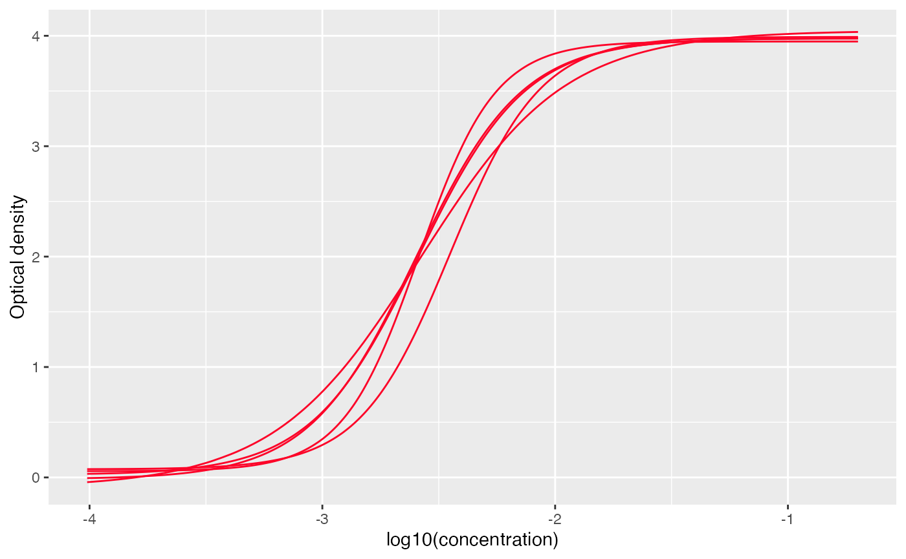
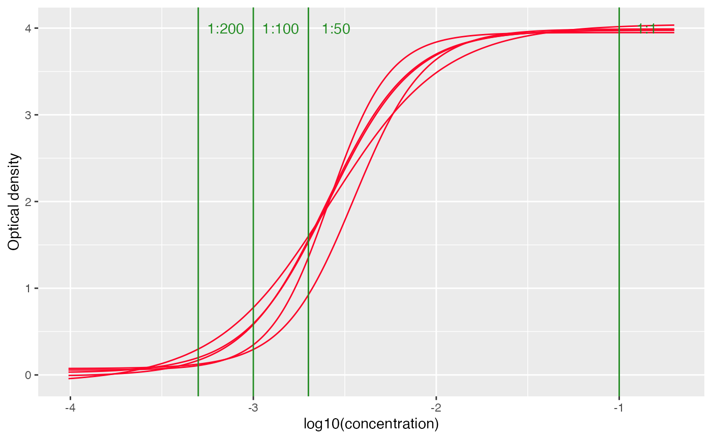
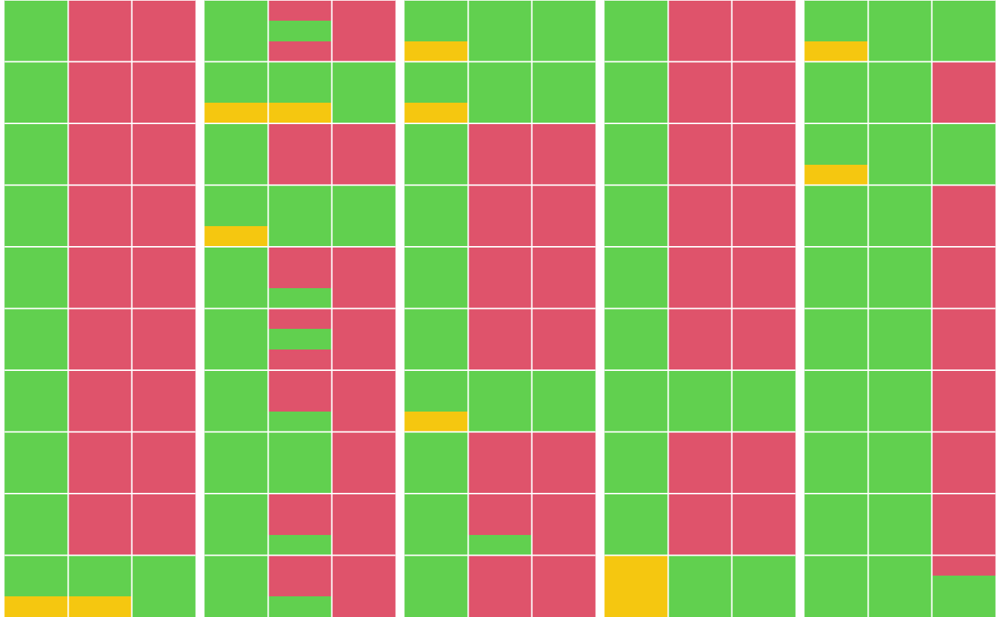
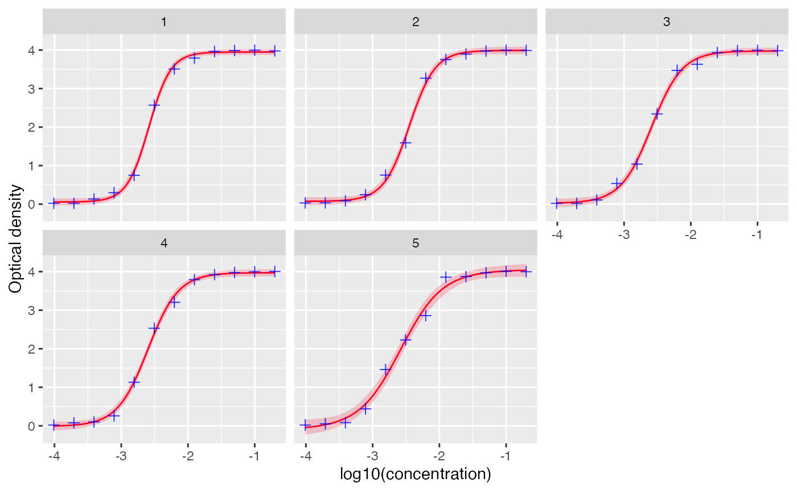

# Convert assay readings to titer

``` r
library(serosv)
library(dplyr)
library(tidyr)
library(magrittr)
```

## Overview

Serological assays often produce raw signals such as optical density
(OD) or fluorescence intensity. These measurements are not directly
interpretable and must be converted to titers (e.g., IU/ml) using a
calibration model.

`serosv` provides the function
[`to_titer()`](https://oucru-modelling.github.io/serosv/reference/to_titer.md)
perform this conversion by fitting a standard curve (per plate) and
mapping assay readings to estimated titers

## Convert to titer workflow

The input data is expected to have the following information

- Sample id containing id for samples **or** label for antitoxins

- Plate id the id of each plate (the standard curve will be fitted for
  each plate)

- Dilution level (e.g., 50, 100, 200)

- (Optionally) the columns for result for negative control at different
  dilution level (e.g., negative_50, negative_100, and negative_200)

To demonstrate the use of this function, we will use a simulated dataset

Code for simulating data

``` r
set.seed(1)
# Config
n_samples <- 50
n_plates  <- 5
dilutions <- c(50, 100, 200)
ref_conc_antitoxin <- 10

# 4PL function: OD = D + (A - D) / (1 + 10^((log10(conc) - c) * b))
mock_4pl <- function(conc, A = 0, B = 1.8, C = -2.5, D = 4) {
  D + (A - D) / (1 + 10^(( log10(conc) - C)*B))
}

# Assign each sample a "true" concentration (UI/ml)
# ~60% positive (conc > 0.1), ~40% negative
sample_meta <- tibble(
  SAMPLE_ID    = sprintf("S%03d", 1:n_samples),
  PLATE_ID     = rep(1:n_plates, length.out = n_samples),
  true_conc    = c(
    runif(round(n_samples * 0.8), 0.15, 100),   # positives
    runif(round(n_samples * 0.2), 0.001, 0.09) # negatives
  ) %>% sample()                               # shuffle
)

# Negative control concentrations per plate (one fixed OD per plate per dilution)
neg_ctrl_conc <- tibble(
  PLATE_ID      = 1:n_plates,
  true_neg_conc = runif(n_plates, 0.001, 0.04),
  neg_conc_50   = true_neg_conc/50,
  neg_conc_100  = true_neg_conc/100,
  neg_conc_200  = true_neg_conc/200
)
neg_ctrl <- neg_ctrl_conc %>%
  mutate(
    NEGATIVE_50  = round(mock_4pl(neg_conc_50)  + rnorm(n_plates, 0, 0.003), 4),
    NEGATIVE_100 = round(mock_4pl(neg_conc_100) + rnorm(n_plates, 0, 0.003), 4),
    NEGATIVE_200 = round(mock_4pl(neg_conc_200) + rnorm(n_plates, 0, 0.003), 4)
  ) %>%
  select(PLATE_ID, NEGATIVE_50, NEGATIVE_100, NEGATIVE_200)

# Antitoxin 
antitoxin_conc <-  c(50, 100, 200, 400, 800, 1600, 3200, 6400, 12800, 25600, 51200, 102400)
antitoxin <- tibble(
  SAMPLE_ID    = rep("Antitoxin", n_plates),
  true_conc    = rep(ref_conc_antitoxin, n_plates),
  PLATE_ID = 1:n_plates
) %>% 
  crossing(
    DILUTION = antitoxin_conc
  ) %>% 
  mutate(
    eff_conc = true_conc/DILUTION
  )

# Generate one row per sample × dilution, compute OD via 4PL + noise
simulated_data <- sample_meta %>%
  crossing(DILUTION = dilutions) %>%
  mutate(
    eff_conc  = true_conc / DILUTION
  ) %>% 
  bind_rows(
    antitoxin
  ) %>% 
  mutate(
    # Effective concentration decreases with dilution
    od_mean   = mock_4pl(eff_conc,
                         B = runif(n(), 1.7, 1.9),
                         C = runif(n(), -2.7, -2.4)),
    noise     = rnorm(n(), 0, 0.008),
    RESULT    = round(pmax(od_mean + noise, 0.02), 4),

    # Blanks: clearly below result (reagent background only)
    BLANK_1   = round(runif(n(), 0.010, pmin(RESULT - 0.01, 0.045)), 4),
    BLANK_2   = round(runif(n(), 0.010, pmin(RESULT - 0.01, 0.045)), 4),
    BLANK_3   = round(runif(n(), 0.010, pmin(RESULT - 0.01, 0.045)), 4)
  ) %>%
  left_join(neg_ctrl, by = "PLATE_ID") %>%
  select(
    SAMPLE_ID, PLATE_ID, 
    DILUTION, RESULT,
    # BLANK_1, BLANK_2, BLANK_3,
    NEGATIVE_50, NEGATIVE_100, NEGATIVE_200
  ) %>%
  arrange(PLATE_ID, SAMPLE_ID, DILUTION)
```

``` r
simulated_data
```

    ## # A tibble: 210 × 7
    ##    SAMPLE_ID PLATE_ID DILUTION RESULT NEGATIVE_50 NEGATIVE_100 NEGATIVE_200
    ##    <chr>        <int>    <dbl>  <dbl>       <dbl>        <dbl>        <dbl>
    ##  1 Antitoxin        1       50  3.98        0.306       0.0939       0.0269
    ##  2 Antitoxin        1      100  4.00        0.306       0.0939       0.0269
    ##  3 Antitoxin        1      200  3.99        0.306       0.0939       0.0269
    ##  4 Antitoxin        1      400  3.96        0.306       0.0939       0.0269
    ##  5 Antitoxin        1      800  3.79        0.306       0.0939       0.0269
    ##  6 Antitoxin        1     1600  3.51        0.306       0.0939       0.0269
    ##  7 Antitoxin        1     3200  2.57        0.306       0.0939       0.0269
    ##  8 Antitoxin        1     6400  0.750       0.306       0.0939       0.0269
    ##  9 Antitoxin        1    12800  0.298       0.306       0.0939       0.0269
    ## 10 Antitoxin        1    25600  0.135       0.306       0.0939       0.0269
    ## # ℹ 200 more rows

**Standardize data**

Before fitting the standard curve, the input data must be standardized
into the required format. This is handled by the function
[`standardize_data()`](https://oucru-modelling.github.io/serosv/reference/standardize_data.md).

``` r
standardized_dat <- standardize_data(
  simulated_data,
  plate_id_col = "PLATE_ID", # specify the column for plate id
  id_col = "SAMPLE_ID", # specify the column for sample id
  result_col = "RESULT", # specify the column for raw assay readings
  dilution_fct_col= "DILUTION", # specify the column for dilution factor
  antitoxin_label = "Antitoxin", # specify the label for antitoxin (in the sample id column)
  negative_col = "^NEGATIVE_*" # (optionally) specify the regex (i.e., pattern) for columns for negative controls
)

standardized_dat
```

    ## # A tibble: 210 × 7
    ##    sample_id plate_id dilution_factors result negative_50 negative_100
    ##    <chr>        <int>            <dbl>  <dbl>       <dbl>        <dbl>
    ##  1 antitoxin        1               50  3.98        0.306       0.0939
    ##  2 antitoxin        1              100  4.00        0.306       0.0939
    ##  3 antitoxin        1              200  3.99        0.306       0.0939
    ##  4 antitoxin        1              400  3.96        0.306       0.0939
    ##  5 antitoxin        1              800  3.79        0.306       0.0939
    ##  6 antitoxin        1             1600  3.51        0.306       0.0939
    ##  7 antitoxin        1             3200  2.57        0.306       0.0939
    ##  8 antitoxin        1             6400  0.750       0.306       0.0939
    ##  9 antitoxin        1            12800  0.298       0.306       0.0939
    ## 10 antitoxin        1            25600  0.135       0.306       0.0939
    ## # ℹ 200 more rows
    ## # ℹ 1 more variable: negative_200 <dbl>

**Fitting data**

The function
[`to_titer()`](https://oucru-modelling.github.io/serosv/reference/to_titer.md)
fits a standard curve for each plate and converts assay readings into
titer estimates.

The users can configure the following:

- `model` either the name of a built-in model (`"4PL"` for 4 parameters
  log-logistic model) or a named list with 2 items `"mod"` and
  `"quantify_ci"`. Section [Custom models](#custom-mod) will provide
  more details on these functions.
- `ci` confidence interval of the titer estimate (default to `.95` for
  95% CI)
- `negative_control` whether to include the result for negative controls
- (optionally) `positive_threshold` the threshold of titer for sample to
  be considered positive. If provided, the output will include
  serostatus

``` r
out <- to_titer(
  standardized_dat,
  model = "4PL",
  ci = 0.95,
  positive_threshold = 0.1,
  negative_control = TRUE
)
```

**Output format**

``` r
out
```

    ## # A tibble: 5 × 8
    ## # Groups:   plate_id [5]
    ##   plate_id data              antitoxin_df standard_curve_df standard_curve_func
    ##      <int> <list>            <list>       <list>            <list>             
    ## 1        1 <tibble [42 × 6]> <tibble>     <df [512 × 4]>    <fn>               
    ## 2        2 <tibble [42 × 6]> <tibble>     <df [512 × 4]>    <fn>               
    ## 3        3 <tibble [42 × 6]> <tibble>     <df [512 × 4]>    <fn>               
    ## 4        4 <tibble [42 × 6]> <tibble>     <df [512 × 4]>    <fn>               
    ## 5        5 <tibble [42 × 6]> <tibble>     <df [512 × 4]>    <fn>               
    ## # ℹ 3 more variables: std_crv_midpoint <dbl>, processed_data <list>,
    ## #   negative_control <list>

The output is a nested tibble with the following columns

- `plate_id` ids of the plate

- `data` list of `data.frame`s containing the input samples data
  corresponding to each plate

- `antitoxin_df` list of `data.frame`s containing the input reference
  data corresponding to each plate

- `standard_curve_func` list of functions mapping from assay reading to
  titer for each plate

- `std_crv_midpoint` midpoint of the standard curve, for qualitative
  analysis

- `processed_data` list of `tibble`s containing samples with titer
  estimates (lower, median, upper)

- `negative_control` list of `tibble`s containing negative control check
  results (if `negative_control=TRUE`)

To access the estimated titers, simply unnest the `processed_data`
column.

``` r
out %>% 
  select(plate_id, processed_data) %>% 
  unnest(processed_data) %>% 
  select(plate_id, sample_id, result, lower, median, upper, positive)
```

    ## # A tibble: 150 × 7
    ## # Groups:   plate_id [5]
    ##    plate_id sample_id result lower median upper positive
    ##       <int> <chr>      <dbl> <dbl>  <dbl> <dbl> <lgl>   
    ##  1        1 S001        4.00 0.973     NA    NA TRUE    
    ##  2        1 S001        4.00 1.88      NA    NA TRUE    
    ##  3        1 S001        4.00 4.20      NA    NA TRUE    
    ##  4        1 S006        4.02 1.45      NA    NA TRUE    
    ##  5        1 S006        4.00 1.87      NA    NA TRUE    
    ##  6        1 S006        3.99 3.35      NA    NA TRUE    
    ##  7        1 S011        4.00 0.912     NA    NA TRUE    
    ##  8        1 S011        3.99 1.63      NA    NA TRUE    
    ##  9        1 S011        4.00 3.89      NA    NA TRUE    
    ## 10        1 S016        4.00 0.991     NA    NA TRUE    
    ## # ℹ 140 more rows

The columns for titer estimates are

- `lower` lower bound of the confidence interval for the titer estimate.

- `median` median (predicted) titer value.

- `upper` upper bound of the confidence interval for titer estimates

**Visualize standard curves**

Standard curves can be visualized using the function
[`plot_standard_curve()`](https://oucru-modelling.github.io/serosv/reference/plot_standard_curve.md)

``` r
# visualize standard curves with datapoints for antitoxin
plot_standard_curve(out, facet=TRUE)
```


``` r
# set facet to FALSE to view all the curves together
plot_standard_curve(out, facet=FALSE)
```



Positive threshold at different dilutions and also be added to the plot
using `add_threshold()` function, note that this only works when
`facet=FALSE`

``` r
# set facet to FALSE to view all the curves together
plot_standard_curve(out, facet=FALSE) +
  add_thresholds(
    dilution_factors = c(50, 100, 200),
    positive_threshold = 0.1
  )
```



**Visualizing estimate availability**

The function
[`plot_titer_qc()`](https://oucru-modelling.github.io/serosv/reference/plot_titer_qc.md)
visualizes whether titer estimates can be computed for each sample
across the tested dilutions.

Each sample is represented as a grid of size
`n_estimates × n_dilutions`, where the cell color indicates estimate
availability:

- **Green**: estimate available

- **Orange**: assay reading is too low to estimate

- **Red**: assay reading is too high to estimate

The sample grids are arranged by plate, with each column corresponding
to a single plate and containing samples from that plate.

``` r
plot_titer_qc(
  out,
  n_plates = NULL, # maximum number of plates to visualize, if NULL then plot all
  n_samples = 10, # maximum number of samples per plate to visualize
  n_dilutions = 3 # number of dilutions used for testing
)
```



## Custom models

The users can also define their own model for fitting the standard curve
and a function for quantifying the confidence intervals.

To do this, define the `model` argument of
[`serosv::to_titer()`](https://oucru-modelling.github.io/serosv/reference/to_titer.md)
as a named list of 2 items where:

- `mod` is a function that takes a `df` as input and return a fitted
  standard curve model

- `quantify_ci` is a function to compute the confidence intervals, with
  the following required arguments

  - `object` the fitted model

  - `newdata` the new predictor values for which predictions are made

  - `nb` the number of samples (required for bootstrapping, but may be
    unused otherwise)

  - `alpha` the significance level

  `quantify_ci` must return a data.frame/tibble with the following
  columns:

  - `lower` lower bound of the confidence interval for the titer
    estimate.

  - `median` median (predicted) titer value.

  - `upper` upper bound of the confidence interval for titer estimate.

**Example**

For demonstration purpose, below is an example for the `mod` and
`quantify_ci` functions for a 4PL model

``` r
library(mvtnorm)
library(purrr)
# custom model function
custom_4PL <- function (df){
  good_guess4PL <- function(x, y, eps = 0.3) {
    nb_rep <- unique(table(x))
    the_order <- order(x)
    x <- x[the_order]
    y <- y[the_order]
    a <- min(y)
    d <- max(y)
    c <- approx(y, x, (d - a)/2, ties = "ordered")$y
    list(a = a, c = c, d = d, b = (approx(x, y, c + eps, ties = "ordered")$y - 
        approx(x, y, c - eps, ties = "ordered")$y)/(2 * eps))
  }
  
  nls(
    result ~ d + (a - d) / (1 + 10 ^ ((log10(concentration) - c) * b)),
    data = df,
    start = with(df, good_guess4PL(log10(concentration), result))
  )
}

# custom quantify CI function for the model
custom_quantify_ci <- function(object, newdata, nb = 9999, alpha = 0.025){
  rowsplit <- function(df) split(df, 1:nrow(df))

  nb |>
    rmvnorm(mean = coef(object), sigma = vcov(object)) |>
    as.data.frame() |>
    rowsplit() |>
    map(as.list) |>
    map(~ c(.x, newdata)) |>
    map_dfc(eval, expr = parse(text = as.character(formula(object))[3])) %>%
    apply(1, quantile, c(alpha, .5, 1 - alpha))  %>%
    t() %>%  as.data.frame() %>%
    setNames(c("lower", "median", "upper"))
}
```

The custom model can be provided as followed

``` r
# use the custom model and quantify ci function
custom_mod <- list(
  "mod" = custom_4PL,
  "quantify_ci" = custom_quantify_ci
)
custom_mod_out <- to_titer(
  standardized_dat,
  model = custom_mod,
  positive_threshold = 0.1, ci = 0.95,
  negative_control = TRUE)
```

Visualize standard curves

``` r
plot_standard_curve(custom_mod_out, facet=TRUE)
```


