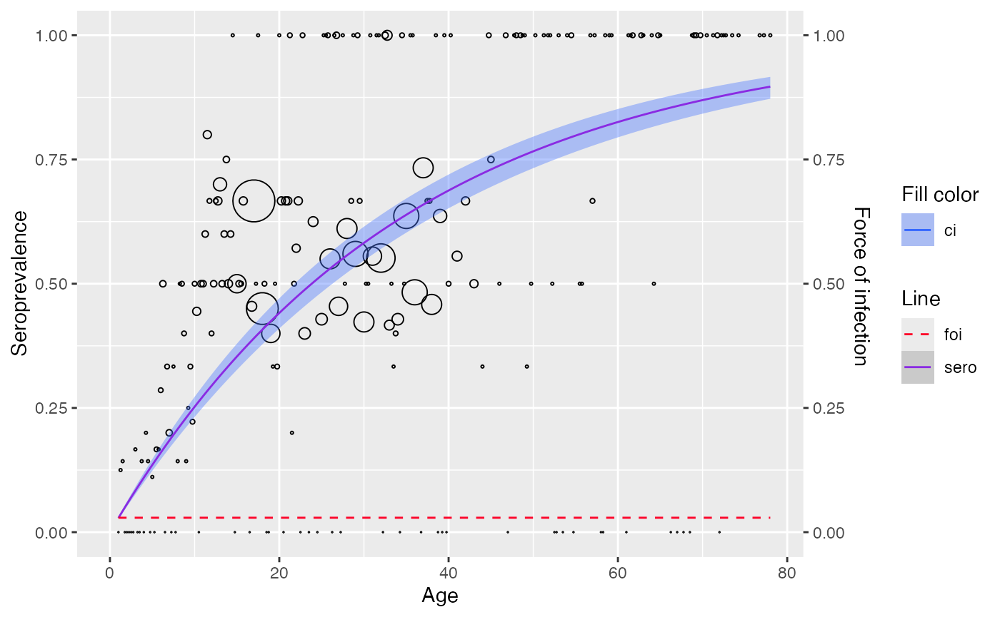

# Input data

``` r
library(serosv)
#> Warning: replacing previous import 'magrittr::extract' by 'tidyr::extract' when
#> loading 'serosv'
library(dplyr)
#> Warning: package 'dplyr' was built under R version 4.3.1
#> 
#> Attaching package: 'dplyr'
#> The following objects are masked from 'package:stats':
#> 
#>     filter, lag
#> The following objects are masked from 'package:base':
#> 
#>     intersect, setdiff, setequal, union
library(magrittr)
```

## Input data format

Most `*_model()` functions in `serosv` require `data` argument as the
input data to be fitted.

The package can handle both linelisting and aggregated data, and it
infers the format from the column names of the input data frame. This
means that input data is *expected to follow a specific format.*

For linelisting data: data must have `age`, `pos` and `tot` columns,
where

- `age` is the age vector

- `pos` is the vector of counts of sero positives of that age group

- `tot` is the vector is the total population of that age group

For aggregated data: data must have `age`, `status` columns, where

- `age` is the age vector of individuals

- `status` is the vector for the sero positivity of that individual

**Example:** Fitting linelisting and aggregated data using
[`polynomial_model()`](https://oucru-modelling.github.io/serosv/reference/polynomial_model.md)

``` r
linelisting <- parvob19_fi_1997_1998[order(parvob19_fi_1997_1998$age), ]
aggregated <- hav_bg_1964

# View the 2 different data format
head(linelisting)
#>     age seropositive year gender parvouml
#> 1     1            0 2001      m        8
#> 2     1            0 2001      m        7
#> 3     1            0 2001      m        6
#> 406   1            0 2001      f       11
#> 407   1            0 2001      f        7
#> 408   1            0 2001      f        5
head(aggregated)
#>   age pos tot
#> 1   1   3  16
#> 2   2   3  15
#> 3   3   3  16
#> 4   4   4  13
#> 5   5   7  12
#> 6   6   4  15

# fit with aggregated data
model1 <- polynomial_model(aggregated, type = "Muench")
plot(model1)
```


``` r
# fit with linelisting data
model2 <- linelisting %>% 
  rename(status = seropositive) %>% 
  polynomial_model(type = "Muench")
plot(model2)
```


## Data transformation

`serosv` also offers function
[`transform_data()`](https://oucru-modelling.github.io/serosv/reference/transform_data.md)
to convert from linelisting to aggregated data. For more information,
refer to [Data
transformation](https://oucru-modelling.github.io/serosv/articles/data_transformation.md)

``` r
transform_data(
  linelisting$age, 
  linelisting$seropositive,
  stratum_col = "age") %>% 
  polynomial_model(type = "Muench") %>% 
  plot()
```


