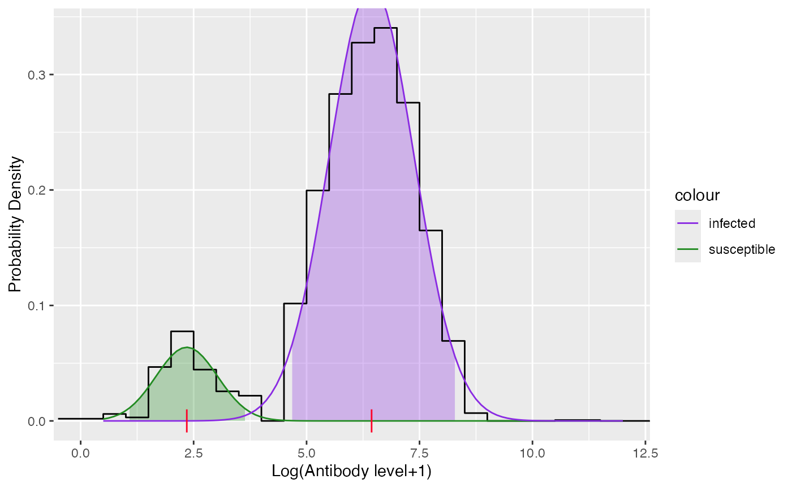
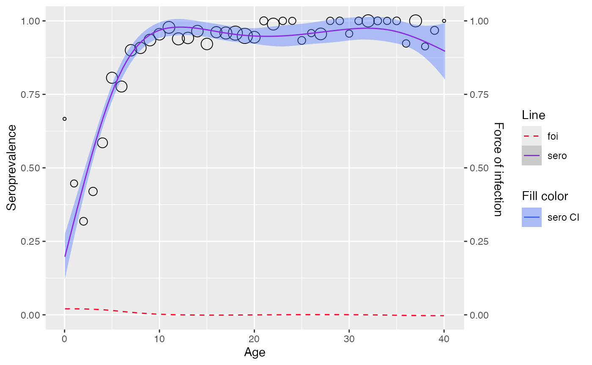

# Modeling directly from antibody levels

``` r
library(serosv)
```

## Mixture model

**Proposed model**

Consider a two-component Gaussian mixture model for the antibody level
\\(Z\\), where each component \\(Z_j\\) represent antibody level arising
from the 2 latent sub-populations \\(j \in \\{I, S\\}\\) (i.e., Infected
and Susceptible groups).

Let \\(f_j(z_j\|\theta_j)\\) denotes the density of component \\(Z_j\\),
where \\(\theta_I\\) and \\(\theta_S\\) are the parameters for the
Susceptible and Infected components respectively.

With \\(\pi\_{\text{TRUE}}(a)\\) being the age-dependent mixing
probability (i.e., the true prevalence), the density of the mixture is
formulated as

\\\[ f(z\|z_I, z_S,a) =
(1-\pi\_{\text{TRUE}}(a))f_S(z_S\|\theta_S)+\pi\_{\text{TRUE}}(a)f_I(z_I\|\theta_I)
\\\]

The age-specific mean antibody level \\(E(Z\|a)\\) thus equals

\\\[ \mu(a) =
(1-\pi\_{\text{TRUE}}(a))\mu_S+\pi\_{\text{TRUE}}(a)\mu_I\\\]

From which the true prevalence can be calculated by

\\\[ \pi\_{\text{TRUE}}(a) = \frac{\mu(a) - \mu_S}{\mu_I - \mu_S} \\\]

Force of infection can then be inferred by

\\\[ \lambda\_{TRUE} = \frac{\mu'(a)}{\mu_I - \mu(a)} \\\]

Refer to Chapter `11.3` of the book by Hens et al. (2012) for a more
detailed explanation of the method.

**Fitting data**

General workflow:

- Step 1: Fit the antibody level data to a 2-component mixture model

- Step 2: From the fitted mixture model, estimate the seroprevalence and
  FOI

To fit the antibody data, use `mixture_model` function

``` r
df <- vzv_be_2001_2003[vzv_be_2001_2003$age < 40.5,]
df <- df[order(df$age),]
data <- df$VZVmIUml
model <- mixture_model(antibody_level = data)
model$info
#> 
#> Parameters:
#>       pi    mu  sigma
#> 1 0.1088 2.349 0.6804
#> 2 0.8912 6.439 0.9437
#> 
#> Distribution:
#> [1] "norm"
#> 
#> Constraints:
#>    conpi    conmu consigma 
#>   "NONE"   "NONE"   "NONE"
```

``` r
plot(model)
```



sero-prevalence and FOI can then be esimated using function
`estimate_from_mixture`

``` r
est_mixture <- estimate_from_mixture(df$age, data, mixture_model = model, threshold_status = df$seropositive, sp=83, monotonize = FALSE)
plot(est_mixture)
#> Warning: No shared levels found between `names(values)` of the manual scale and the
#> data's fill values.
```



Hens, Niel, Ziv Shkedy, Marc Aerts, Christel Faes, Pierre Van Damme, and
Philippe Beutels. 2012. *Modeling Infectious Disease Parameters Based on
Serological and Social Contact Data: A Modern Statistical Perspective*.
*Statistics for Biology and Health*. Springer New York.
<https://doi.org/10.1007/978-1-4614-4072-7>.
