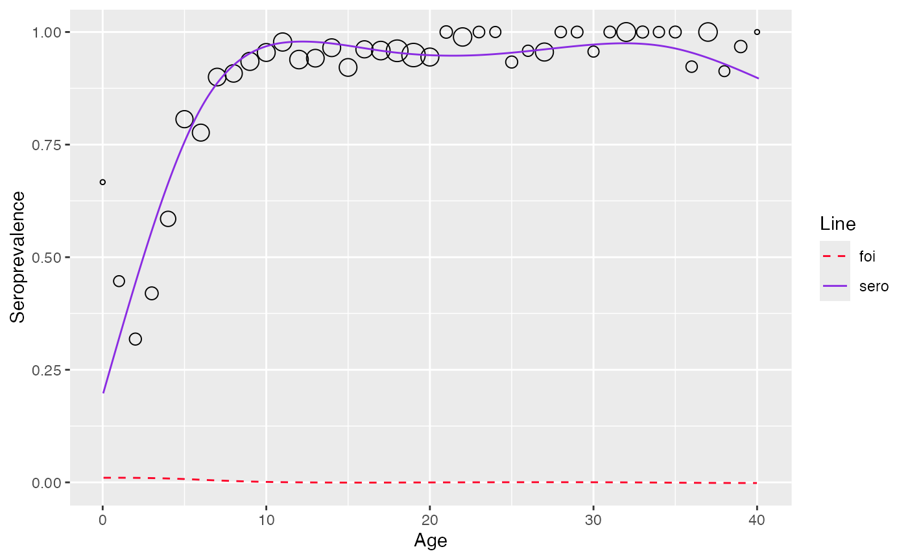

# Modeling directly from antibody levels

``` r
library(serosv)
```

## Mixture model

**Proposed model**

Two-component mixture model for test result $Z$ with
$Z_{j}\left( j = \{ I,S\} \right)$ being the latent mixing component
having density $f_{j}\left( z_{j}|\theta_{j} \right)$ and with
$\pi_{\text{TRUE}}(a)$ being the age-dependent mixing probability can be
represented as

$$f\left( z|z_{I},z_{S},a \right) = \left( 1 - \pi_{\text{TRUE}}(a) \right)f_{S}\left( z_{S}|\theta_{S} \right) + \pi_{\text{TRUE}}(a)f_{I}\left( z_{I}|\theta_{I} \right)$$

The mean $E\left( Z|a \right)$ thus equals

$$\mu(a) = \left( 1 - \pi_{\text{TRUE}}(a) \right)\mu_{S} + \pi_{\text{TRUE}}(a)\mu_{I}$$

From which the true prevalence can be calculated by

$$\pi_{\text{TRUE}}(a) = \frac{\mu(a) - \mu_{S}}{\mu_{I} - \mu_{S}}$$

Force of infection can then be calculated by

$$\lambda_{TRUE} = \frac{\mu\prime(a)}{\mu_{I} - \mu(a)}$$

**Fitting data**

To fit the mixture data, use `mixture_model` function

``` r
df <- vzv_be_2001_2003[vzv_be_2001_2003$age < 40.5,]
df <- df[order(df$age),]
data <- df$VZVmIUml
model <- mixture_model(antibody_level = data)
model$info
#> 
#> Parameters:
#>       pi    mu  sigma
#> 1 0.1088 2.349 0.6804
#> 2 0.8912 6.439 0.9437
#> 
#> Distribution:
#> [1] "norm"
#> 
#> Constraints:
#>    conpi    conmu consigma 
#>   "NONE"   "NONE"   "NONE"
```

``` r
plot(model)
```


sero-prevalence and FOI can then be esimated using function
`estimate_from_mixture`

``` r
est_mixture <- estimate_from_mixture(df$age, data, mixture_model = model, threshold_status = df$seropositive, sp=83, monotonize = FALSE)
plot(est_mixture)
#> Warning: No shared levels found between `names(values)` of the manual scale and the
#> data's fill values.
```


