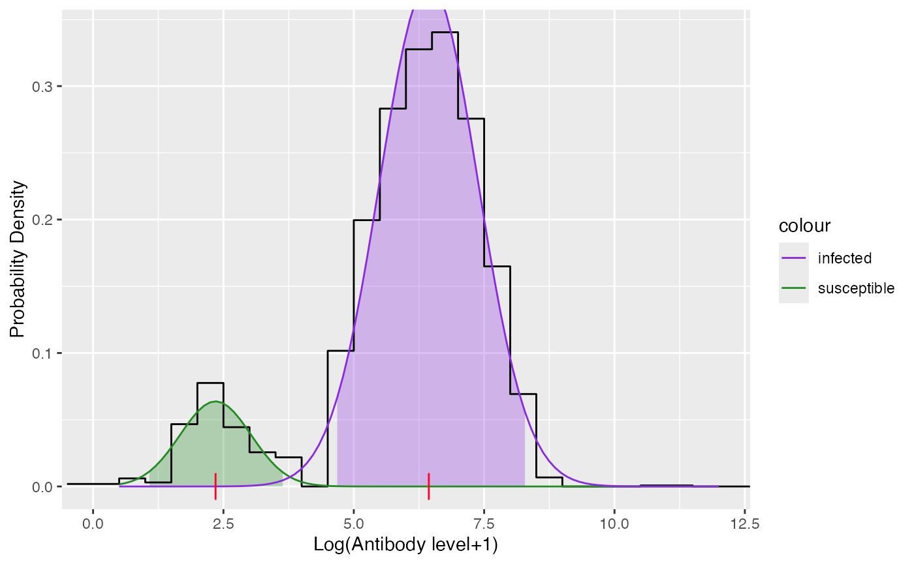

# Modeling directly from antibody levels

``` r
library(serosv)
#> Warning: replacing previous import 'magrittr::extract' by 'tidyr::extract' when
#> loading 'serosv'
```

## Mixture model

**Proposed model**

Two-component mixture model for test result \\(Z\\) with \\(Z_j (j =
\\{I, S\\})\\) being the latent mixing component having density
\\(f_j(z_j\|\theta_j)\\) and with \\(\pi\_{\text{TRUE}}(a)\\) being the
age-dependent mixing probability can be represented as

\\\[ f(z\|z_I, z_S,a) =
(1-\pi\_{\text{TRUE}}(a))f_S(z_S\|\theta_S)+\pi\_{\text{TRUE}}(a)f_I(z_I\|\theta_I)
\\\]

The mean \\(E(Z\|a)\\) thus equals

\\\[ \mu(a) =
(1-\pi\_{\text{TRUE}}(a))\mu_S+\pi\_{\text{TRUE}}(a)\mu_I\\\]

From which the true prevalence can be calculated by

\\\[ \pi\_{\text{TRUE}}(a) = \frac{\mu(a) - \mu_S}{\mu_I - \mu_S} \\\]

Force of infection can then be calculated by

\\\[ \lambda\_{TRUE} = \frac{\mu'(a)}{\mu_I - \mu(a)} \\\]

**Fitting data**

To fit the mixture data, use `mixture_model` function

``` r
df <- vzv_be_2001_2003[vzv_be_2001_2003$age < 40.5,]
df <- df[order(df$age),]
data <- df$VZVmIUml
model <- mixture_model(antibody_level = data)
model$info
#> 
#> Parameters:
#>       pi    mu  sigma
#> 1 0.1088 2.349 0.6804
#> 2 0.8912 6.439 0.9437
#> 
#> Distribution:
#> [1] "norm"
#> 
#> Constraints:
#>    conpi    conmu consigma 
#>   "NONE"   "NONE"   "NONE"
```

``` r
plot(model)
```



sero-prevalence and FOI can then be esimated using function
`estimate_from_mixture`

``` r
est_mixture <- estimate_from_mixture(df$age, data, mixture_model = model, threshold_status = df$seropositive, sp=83, monotonize = FALSE)
plot(est_mixture)
#> Warning: No shared levels found between `names(values)` of the manual scale and the
#> data's fill values.
```


