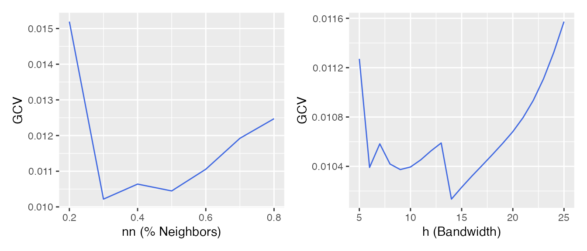
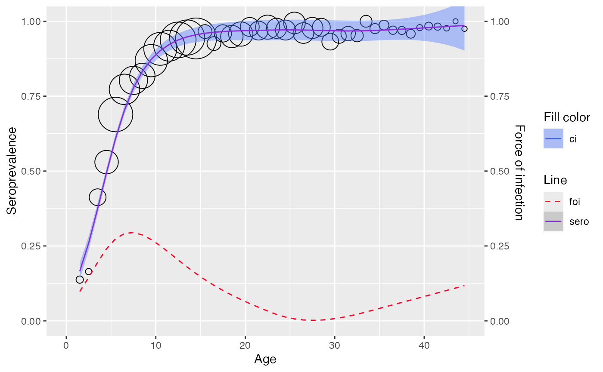

# Nonparametric model

``` r
library(serosv)
```

## Local estimation by polynomial

Refer to `Chapter 7.1` of the book by @Hens2012 for a more detailed
explanation of the method.

**Proposed model**

Within the local polynomial framework, the linear predictor $\eta(a)$ is
approximated locally at one particular value $a_{0}$ for age by a line
(local linear) or a parabola (local quadratic).

The estimator for the $k$-th derivative of $\eta\left( a_{0} \right)$,
for $k = 0,1,\ldots,p$ (degree of local polynomial) is as followed:

$${\widehat{\eta}}^{(k)}\left( a_{0} \right) = k!{\widehat{\beta}}_{k}\left( a_{0} \right)$$

The estimator for the prevalence at age $a_{0}$ is then given by

$$\widehat{\pi}\left( a_{0} \right) = g^{- 1}\{{\widehat{\beta}}_{0}\left( a_{0} \right)\}$$

- Where $g$ is the link function

The estimator for the force of infection at age $a_{0}$ by assuming
$p \geq 1$ is as followed

$$\widehat{\lambda}\left( a_{0} \right) = {\widehat{\beta}}_{1}\left( a_{0} \right)\delta\{{\widehat{\beta}}_{0}\left( a_{0} \right)\}$$

- Where
  $\delta\{{\widehat{\beta}}_{0}\left( a_{0} \right)\} = \frac{dg^{- 1}\{{\widehat{\beta}}_{0}\left( a_{0} \right)\}}{d{\widehat{\beta}}_{0}\left( a_{0} \right)}$

**Fitting data**

``` r
mump <- mumps_uk_1986_1987
```

Use
[`plot_gcv()`](https://oucru-modelling.github.io/serosv/reference/plot_gcv.md)
to show GCV curves for the nearest neighbor method (left) and constant
bandwidth (right).

``` r
plot_gcv(
   mump$age, mump$pos, mump$tot,
   nn_seq = seq(0.2, 0.8, by=0.1),
   h_seq = seq(5, 25, by=1)
 )
```



Use
[`lp_model()`](https://oucru-modelling.github.io/serosv/reference/lp_model.md)
to fit a local estimation by polynomials.

``` r
lp <- lp_model(mump, kern="tcub", nn=0.7, deg=2)
plot(lp)
```


