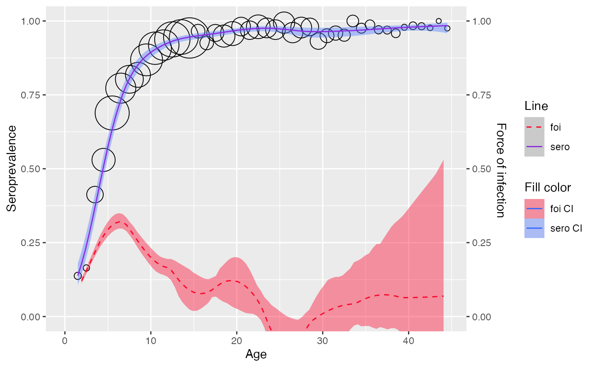
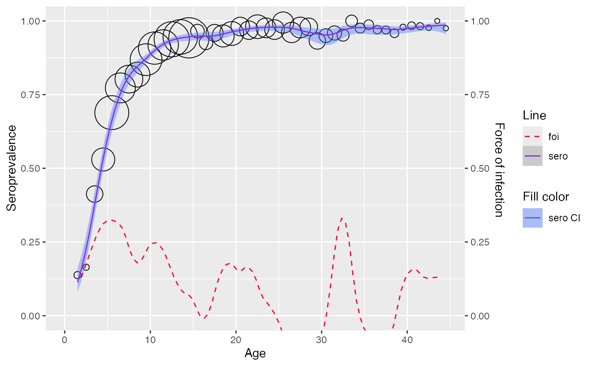
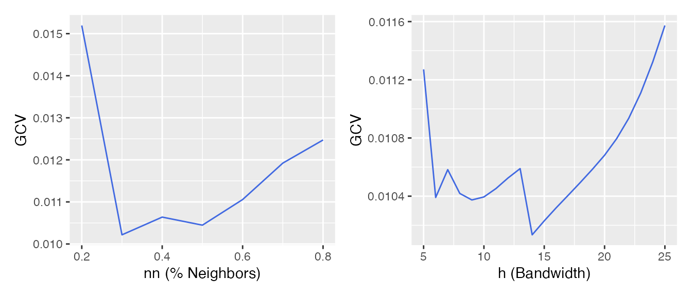
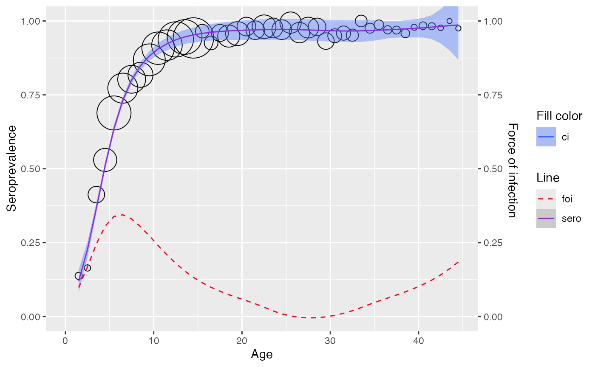

# Nonparametric model

``` r
library(serosv)
library(magrittr)
```

## Local estimation by polynomial

**Proposed model**

Within the local polynomial framework, the linear predictor \\\eta(a)\\
is approximated locally at one particular value \\a_0\\ for age by a
line (local linear, degree \\p=1\\) or a parabola (local quadratic,
degree \\p=2\\).

For a general degree \\p\\, the linear predictor for a neighbor of
\\a_0\\, labeled \\a_i\\ is the Taylor approximation

\\ \eta(a_i) = \eta(a_0) + \eta^{(1)}(a_0)(a_i - a_0) +
\frac{\eta^{(2)}(a_0)}{2}(a_i - a_0)^2 + ... +
\frac{\eta^{(p)}(a_0)}{p!}(a_i - a_0)^p \\

Where the estimator for the \\k\\-th derivative of \\\eta(a_0)\\, for
\\k = 0,1,…,p\\ (degree of local polynomial) is as followed:

\\ \hat{\eta}^{(k)}(a_0) = k!\hat{\beta}\_k(a_0) \\

The estimator for the prevalence at age \\a_0\\ is then given by

\\ \hat{\pi}(a_0) = g^{-1}\\ \hat{\beta}\_0(a_0) \\ \\

- Where \\g\\ is the link function

The estimator for the force of infection at age \\a_0\\ by assuming \\p
\ge 1\\ is as followed

\\ \hat{\lambda}(a_0) = \hat{\beta}\_1(a_0) \delta \\ \hat{\beta}\_0
(a_0) \\ \\

- Where \\\delta \\ \hat{\beta}\_0(a_0) \\ = \frac{dg^{-1} \\
  \hat{\beta}\_0(a_0) \\ } {d\hat{\beta}\_0(a_0)}\\

Refer to `Chapter 7.1` of the book by Hens et al. (2012) for a more
detailed explanation of the method.

**Fitting data**

``` r
mump <- mumps_uk_1986_1987
```

To fit a local estimation by polynomials, use
[`lp_model()`](https://oucru-modelling.github.io/serosv/reference/lp_model.md)
function with model parameters include:

- `nn` the number of nearest neighbors to be included in the
  approximation (i.e., the nearest neighbor component of the smoothing
  parameter)

- `h` the constant component of the smoothing parameter

- `deg` the degree of the polynomial

- `kern` the type of kernel

``` r
lp <- lp_model(mump, kern="tcub", nn = 0.5, deg=2)
lp
#> Local polynomial model 
#> 
#> Input type:  aggregated 
#> Configs:  nn=0.5, bandwidth(h)=0, degree=2, kernel=tcub 
#> 
#> Call:
#> locfit(formula = y ~ lp(age, deg = deg, nn = nn, h = h), family = "binomial", 
#>     kern = kern)
#> 
#> Number of observations:          44 
#> Family:  Logistic 
#> Fitted Degrees of freedom:       6.463 
#> Residual scale:                  1
plot(lp)
```



The users can also provide `h` or `nn` as a numeric vector, in which
case the package will use the parameter value that minimize the
generalized cross-validation (GCV) criterion.

``` r
# ----- Tune nearest neighbor (nn) parameter
lp_model(mump, kern="tcub", nn = seq(0.2, 0.8, 0.1), deg=2) %>% 
  plot()
```



``` r

# ----- Tune bandwidth (h) parameter
lp_model(mump, kern="tcub", h = seq(5,25), deg=2) %>% 
  plot()
```


Alternatively, use
[`plot_gcv()`](https://oucru-modelling.github.io/serosv/reference/plot_gcv.md)
to show GCV curves for the nearest neighbor method (left) and constant
bandwidth (right) for manual parameter selection.

``` r
plot_gcv(
   mump$age, mump$pos, mump$tot,
   nn_seq = seq(0.2, 0.8, by=0.1),
   h_seq = seq(5, 25, by=1)
 )
```



Based on the plot, we can then fit the model using the parameter value
that give the lowest GCV (`nn = 0.3` and `h = 14`)

``` r
lp_model(mump, kern="tcub", nn = 0.3, deg=2) %>% 
  plot()
```


``` r

lp_model(mump, kern="tcub", h = 14, deg=2)  %>% 
  plot()
```



Hens, Niel, Ziv Shkedy, Marc Aerts, Christel Faes, Pierre Van Damme, and
Philippe Beutels. 2012. *Modeling Infectious Disease Parameters Based on
Serological and Social Contact Data: A Modern Statistical Perspective*.
*Statistics for Biology and Health*. Springer New York.
<https://doi.org/10.1007/978-1-4614-4072-7>.
