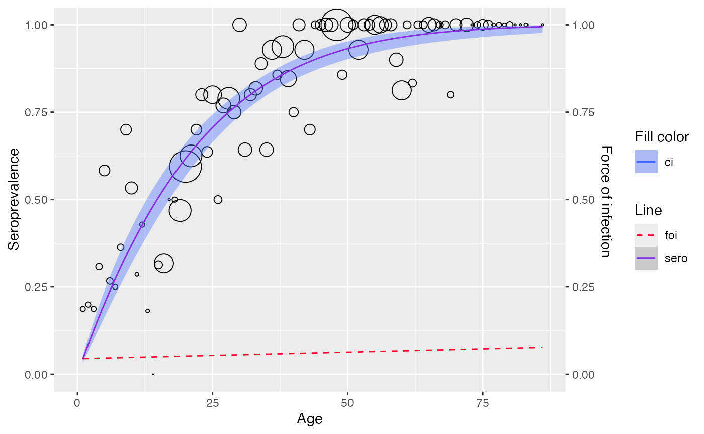
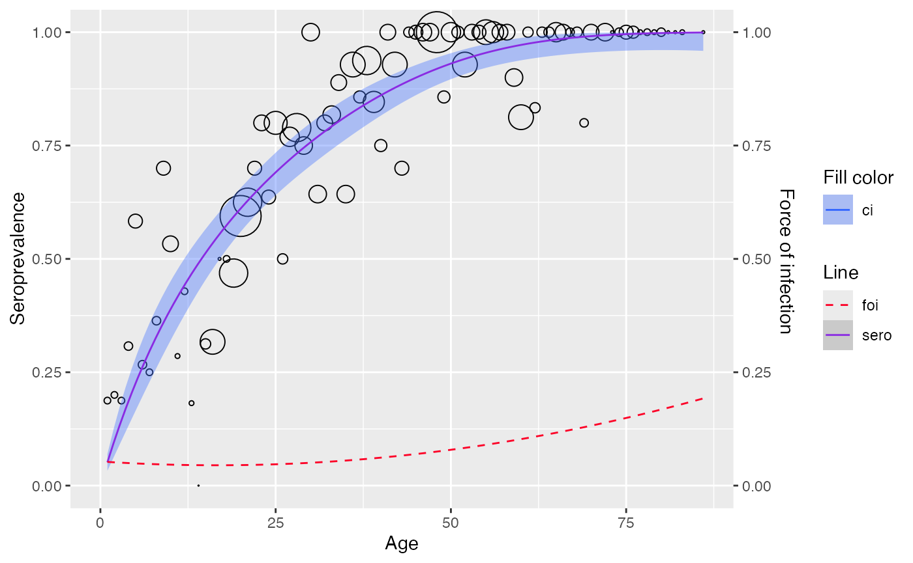
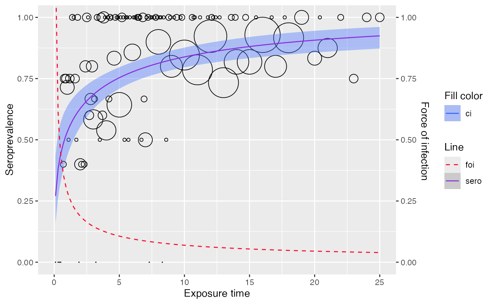

# Parametric models

``` r
library(serosv)
library(dplyr)
library(magrittr)
```

## Frequentist methods

### Polynomial models

Refer to `Chapter 6.1.1` of the book by Hens et al.
([2012](#ref-Hens2012)) for a more detailed explanation of the methods.

Use
[`polynomial_model()`](https://oucru-modelling.github.io/serosv/reference/polynomial_model.md)
to fit a polynomial model.

We will use the `Hepatitis A` data from Belgium 1993–1994 for this
example.

``` r
data <- hav_bg_1964
```

#### Muench model

**Proposed model**

([Muench 1934](#ref-muench_derivation_1934)) suggested to model the
infection process with so-called “catalytic model”, in which the
distribution of the time spent in the susceptible class in SIR model is
exponential with rate $\beta$

$$\pi(a) = k\left( 1 - e^{- \beta a} \right)$$

Where:

- $\pi$ is the seroprevalence at age $a$
- $1 - k$ is the proportion of population that stay uninfected for a
  lifetime
- $a$ is the variable age

Under this catalytic model and assuming that $k = 1$, force infection
would be $\lambda(a) = \beta$

**Fitting data**

**Muench**’s model can be estimated by either defining `k = 1` (a degree
one linear predictor, note that it is irrelevant to the k in the
proposed model) or setting the `type = "Muench"`.

``` r
muench1 <- polynomial_model(data, k = 1)
summary(muench1$info)
#> 
#> Call:
#> glm(formula = age(k), family = binomial(link = link), data = df)
#> 
#> Coefficients:
#>      Estimate Std. Error z value Pr(>|z|)    
#> Age -0.050500   0.002457  -20.55   <2e-16 ***
#> ---
#> Signif. codes:  0 '***' 0.001 '**' 0.01 '*' 0.05 '.' 0.1 ' ' 1
#> 
#> (Dispersion parameter for binomial family taken to be 1)
#> 
#>     Null deviance:    Inf  on 83  degrees of freedom
#> Residual deviance: 97.275  on 82  degrees of freedom
#> AIC: 219.19
#> 
#> Number of Fisher Scoring iterations: 5

muench2 <- polynomial_model(data, type = "Muench")
summary(muench2$info)
#> 
#> Call:
#> glm(formula = age(k), family = binomial(link = link), data = df)
#> 
#> Coefficients:
#>      Estimate Std. Error z value Pr(>|z|)    
#> Age -0.050500   0.002457  -20.55   <2e-16 ***
#> ---
#> Signif. codes:  0 '***' 0.001 '**' 0.01 '*' 0.05 '.' 0.1 ' ' 1
#> 
#> (Dispersion parameter for binomial family taken to be 1)
#> 
#>     Null deviance:    Inf  on 83  degrees of freedom
#> Residual deviance: 97.275  on 82  degrees of freedom
#> AIC: 219.19
#> 
#> Number of Fisher Scoring iterations: 5
```

We can plot any model with the
[`plot()`](https://rdrr.io/r/graphics/plot.default.html) function.

``` r
plot(muench2) 
```


#### Griffith model

**Proposed model**

Griffith proposed a model for force of infection as followed

$$\lambda(a) = \beta_{1} + 2\beta_{2}a$$

Which can be estimated using a GLM where the for which the linear
predictor was $\eta(a) = \beta_{1}a + \beta_{2}a^{2}$

**Fitting data**

Similarly, we can estimate **Griffith**’s model either by defining
`k = 2`, or setting the `type = "Griffith"`

``` r
gf_model <- polynomial_model(data, type = "Griffith")
plot(gf_model)
```



#### Grenfell and Anderson model

**Proposed model**

([Grenfell and Anderson 1985](#ref-grenfell_estimation_1985)) extended
the models of Muench and Griffiths further suggest the use of higher
order polynomial functions to model the force of infection which assumes
prevalence model as followed

$$\pi(a) = 1 - e^{- \Sigma_{i}\beta_{i}a^{i}}$$

Which implies that force of infection equals
$\lambda(a) = \Sigma\beta_{i}ia^{i - 1}$

**Fitting data**

And Grenfell and Anderson’s model.

``` r
grf_model <- polynomial_model(data, type = "Grenfell")
plot(grf_model)
```



------------------------------------------------------------------------

### Nonlinear models

Refer to `Chapter 6.1.2` of the book by Hens et al.
([2012](#ref-Hens2012)) for a more detailed explanation of the methods.

#### Farrington model

**Proposed model**

For Farrington’s model, the force of infection was defined non-negative
for all a $\lambda(a) \geq 0$ and increases to a peak in a linear
fashion followed by an exponential decrease

$$\lambda(a) = (\alpha a - \gamma)e^{- \beta a} + \gamma$$

Where $\gamma$ is called the long term residual for FOI, as
$\left. a\rightarrow\infty \right.$ ,
$\left. \lambda(a)\rightarrow\gamma \right.$

Integrating $\lambda(a)$ would results in the following non-linear model
for prevalence

\$\$ \pi (a) = 1 - e^{-\int_0^a \lambda(s) ds} \\\\ = 1 - exp\\{
\frac{\alpha}{\beta}ae^{-\beta a} +
\frac{1}{\beta}(\frac{\alpha}{\beta} - \gamma)(e^{-\beta a} - 1) -\gamma
a \\} \$\$

**Fitting data**

Use
[`farrington_model()`](https://oucru-modelling.github.io/serosv/reference/farrington_model.md)
to fit a **Farrington**’s model.

``` r
farrington_md <- farrington_model(
   rubella_uk_1986_1987,
   start=list(alpha=0.07,beta=0.1,gamma=0.03)
   )
plot(farrington_md)
```


#### Weibull model

**Proposed model**

For a Weibull model, the prevalence is given by

$$\pi(d) = 1 - e^{- \beta_{0}d^{\beta_{1}}}$$

Where $d$ is exposure time (difference between age of injection and age
at test)

The model was reformulated as a GLM model with log - log link and linear
predictor using log(d)

$$\eta(d) = log\left( \beta_{0} \right) + \beta_{1}log(d)$$

Thus implies that the force of infection is a monotone function of the
exposure time as followed

$$\lambda(d) = \beta_{0}\beta_{1}d^{\beta_{1} - 1}$$

**Fitting data**

Use
[`weibull_model()`](https://oucru-modelling.github.io/serosv/reference/weibull_model.md)
to fit a Weibull model.

``` r
hcv <- hcv_be_2006[order(hcv_be_2006$dur), ]

wb_md <- hcv %>% 
  rename(
    t = dur, status = seropositive
  ) %>% weibull_model()
plot(wb_md) 
```



------------------------------------------------------------------------

### Fractional polynomial model

Refer to `Chapter 6.2` of the book by Hens et al.
([2012](#ref-Hens2012)) for a more detailed explanation of the methods.

**Proposed model**

Fractional polynomial model generalize conventional polynomial class of
functions. In the context of binary responses, a fractional polynomial
of degree $m$ for the linear predictor is defined as followed

$$\eta_{m}\left( a,\beta,p_{1},p_{2},...,p_{m} \right) = \Sigma_{i = 0}^{m}\beta_{i}H_{i}(a)$$

Where $m$ is an integer, $p_{1} \leq p_{2} \leq ... \leq p_{m}$ is a
sequence of powers, and $H_{i}(a)$ is a transformation given by

$$H_{i} = \begin{cases}
a^{p_{i}} & {{\mspace{6mu}\text{if}\mspace{6mu}}p_{i} \neq p_{i - 1},} \\
{H_{i - 1}(a) \times log(a)} & {{\mspace{6mu}\text{if}\mspace{6mu}}p_{i} = p_{i - 1},} \\
\end{cases}$$

**Best power selection**

Use
[`find_best_fp_powers()`](https://oucru-modelling.github.io/serosv/reference/find_best_fp_powers.md)
to find the powers which gives the lowest deviance score

``` r
hav <- hav_be_1993_1994
best_p <- find_best_fp_powers(
  hav,
  p=seq(-2,3,0.1), mc=FALSE, degree=2, link="cloglog"
)
best_p
#> $p
#> [1] 1.5 1.6
#> 
#> $deviance
#> [1] 81.60333
#> 
#> $model
#> 
#> Call:  glm(formula = as.formula(formulate(p_cur)), family = binomial(link = link))
#> 
#> Coefficients:
#> (Intercept)   I(age^1.5)   I(age^1.6)  
#>    -3.61083      0.12443     -0.07656  
#> 
#> Degrees of Freedom: 85 Total (i.e. Null);  83 Residual
#> Null Deviance:       1320 
#> Residual Deviance: 81.6  AIC: 361.2
```

**Fitting data**

Use
[`fp_model()`](https://oucru-modelling.github.io/serosv/reference/fp_model.md)
to fit a fractional polynomial model

``` r
model <- fp_model(hav, p=c(1.5, 1.6), link="cloglog")
plot(model)
```


## Bayesian methods

**Proposed approach**

Prevalence has a parametric form $\pi\left( a_{i},\alpha \right)$ where
$\alpha$ is a parameter vector

One can constraint the parameter space of the prior distribution
$P(\alpha)$ in order to achieve the desired monotonicity of the
posterior distribution $P\left( \pi_{1},\pi_{2},...,\pi_{m}|y,n \right)$

Where:

- $n = \left( n_{1},n_{2},...,n_{m} \right)$ and $n_{i}$ is the sample
  size at age $a_{i}$

- $y = \left( y_{1},y_{2},...,y_{m} \right)$ and $y_{i}$ is the number
  of infected individual from the $n_{i}$ sampled subjects

### Farrington

Refer to `Chapter 10.3.1` of the book by Hens et al.
([2012](#ref-Hens2012)) for a more detailed explanation of the method.

**Proposed model**

The model for prevalence is as followed

$$\pi(a) = 1 - exp\{\frac{\alpha_{1}}{\alpha_{2}}ae^{- \alpha_{2}a} + \frac{1}{\alpha_{2}}\left( \frac{\alpha_{1}}{\alpha_{2}} - \alpha_{3} \right)\left( e^{- \alpha_{2}a} - 1 \right) - \alpha_{3}a\}$$

For likelihood model, independent binomial distribution are assumed for
the number of infected individuals at age $a_{i}$

$$y_{i} \sim Bin\left( n_{i},\pi_{i} \right),{\mspace{6mu}\text{for}\mspace{6mu}}i = 1,2,3,...m$$

The constraint on the parameter space can be incorporated by assuming
truncated normal distribution for the components of $\alpha$,
$\alpha = \left( \alpha_{1},\alpha_{2},\alpha_{3} \right)$ in
$\pi_{i} = \pi\left( a_{i},\alpha \right)$

$$\alpha_{j} \sim {\text{truncated}\mspace{6mu}}\mathcal{N}\left( \mu_{j},\tau_{j} \right),{\mspace{6mu}\mspace{6mu}}j = 1,2,3$$

The joint posterior distribution for $\alpha$ can be derived by
combining the likelihood and prior as followed

$$P\left( \alpha|y \right) \propto \prod\limits_{i = 1}^{m}\text{Bin}\left( y_{i}|n_{i},\pi\left( a_{i},\alpha \right) \right)\prod\limits_{i = 1}^{3} - \frac{1}{\tau_{j}}\text{exp}\left( \frac{1}{2\tau_{j}^{2}}\left( \alpha_{j} - \mu_{j} \right)^{2} \right)$$

- Where the flat hyperprior distribution is defined as followed:

  - $\mu_{j} \sim \mathcal{N}(0,10000)$

  - $\tau_{j}^{- 2} \sim \Gamma(100,100)$

The full conditional distribution of $\alpha_{i}$ is thus
$$P\left( \alpha_{i}|\alpha_{j},\alpha_{k},k,j \neq i \right) \propto - \frac{1}{\tau_{i}}\text{exp}\left( \frac{1}{2\tau_{i}^{2}}\left( \alpha_{i} - \mu_{i} \right)^{2} \right)\prod\limits_{i = 1}^{m}\text{Bin}\left( y_{i}|n_{i},\pi\left( a_{i},\alpha \right) \right)$$

**Fitting data**

To fit Farrington model, use
[`hierarchical_bayesian_model()`](https://oucru-modelling.github.io/serosv/reference/hierarchical_bayesian_model.md)
and define `type = "far2"` or `type = "far3"` where

- `type = "far2"` refers to Farrington model with 2 parameters
  ($\alpha_{3} = 0$)

- `type = "far3"` refers to Farrington model with 3 parameters
  ($\alpha_{3} > 0$)

``` r
df <- mumps_uk_1986_1987
model <- hierarchical_bayesian_model(df, type="far3")
#> 
#> SAMPLING FOR MODEL 'fra_3' NOW (CHAIN 1).
#> Chain 1: Rejecting initial value:
#> Chain 1:   Log probability evaluates to log(0), i.e. negative infinity.
#> Chain 1:   Stan can't start sampling from this initial value.
#> Chain 1: 
#> Chain 1: Gradient evaluation took 0.000135 seconds
#> Chain 1: 1000 transitions using 10 leapfrog steps per transition would take 1.35 seconds.
#> Chain 1: Adjust your expectations accordingly!
#> Chain 1: 
#> Chain 1: 
#> Chain 1: Iteration:    1 / 5000 [  0%]  (Warmup)
#> Chain 1: Iteration:  500 / 5000 [ 10%]  (Warmup)
#> Chain 1: Iteration: 1000 / 5000 [ 20%]  (Warmup)
#> Chain 1: Iteration: 1500 / 5000 [ 30%]  (Warmup)
#> Chain 1: Iteration: 1501 / 5000 [ 30%]  (Sampling)
#> Chain 1: Iteration: 2000 / 5000 [ 40%]  (Sampling)
#> Chain 1: Iteration: 2500 / 5000 [ 50%]  (Sampling)
#> Chain 1: Iteration: 3000 / 5000 [ 60%]  (Sampling)
#> Chain 1: Iteration: 3500 / 5000 [ 70%]  (Sampling)
#> Chain 1: Iteration: 4000 / 5000 [ 80%]  (Sampling)
#> Chain 1: Iteration: 4500 / 5000 [ 90%]  (Sampling)
#> Chain 1: Iteration: 5000 / 5000 [100%]  (Sampling)
#> Chain 1: 
#> Chain 1:  Elapsed Time: 17.18 seconds (Warm-up)
#> Chain 1:                97.215 seconds (Sampling)
#> Chain 1:                114.395 seconds (Total)
#> Chain 1:
#> Warning: There were 288 divergent transitions after warmup. See
#> https://mc-stan.org/misc/warnings.html#divergent-transitions-after-warmup
#> to find out why this is a problem and how to eliminate them.
#> Warning: There were 11 transitions after warmup that exceeded the maximum treedepth. Increase max_treedepth above 10. See
#> https://mc-stan.org/misc/warnings.html#maximum-treedepth-exceeded
#> Warning: Examine the pairs() plot to diagnose sampling problems
#> Warning: Tail Effective Samples Size (ESS) is too low, indicating posterior variances and tail quantiles may be unreliable.
#> Running the chains for more iterations may help. See
#> https://mc-stan.org/misc/warnings.html#tail-ess

model$info
#>                       mean      se_mean           sd          2.5%
#> alpha1        1.396732e-01 2.328172e-04 5.926643e-03  1.290067e-01
#> alpha2        1.989632e-01 3.342249e-04 8.454176e-03  1.847781e-01
#> alpha3        9.017286e-03 2.957517e-04 7.503320e-03  2.519932e-04
#> tau_alpha1    2.051039e+00 2.925237e-01 5.992958e+00  1.814318e-06
#> tau_alpha2    4.280878e+00 1.545375e+00 1.261621e+01  5.514011e-06
#> tau_alpha3    1.594944e+00 2.713658e-01 4.513571e+00  1.717967e-06
#> mu_alpha1    -2.434489e+00 4.143249e+00 4.467754e+01 -1.656101e+02
#> mu_alpha2    -9.043922e-01 1.406475e+00 3.373188e+01 -9.031034e+01
#> mu_alpha3     2.147579e+00 1.666808e+00 4.272829e+01 -9.818932e+01
#> sigma_alpha1  9.673678e+03 9.523462e+03 2.012224e+05  2.027127e-01
#> sigma_alpha2  8.037575e+01 1.664371e+01 5.816331e+02  1.342710e-01
#> sigma_alpha3  1.665419e+02 4.235920e+01 1.470059e+03  2.354869e-01
#> lp__         -2.534311e+03 2.684310e-01 4.176499e+00 -2.542650e+03
#>                        25%           50%           75%         97.5%      n_eff
#> alpha1        1.353546e-01  1.393536e-01  1.435425e-01  1.520502e-01  648.01829
#> alpha2        1.931939e-01  1.981250e-01  2.037919e-01  2.181404e-01  639.83066
#> alpha3        3.301399e-03  6.948630e-03  1.310897e-02  2.798314e-02  643.65402
#> tau_alpha1    4.699710e-04  1.339575e-02  4.377299e-01  2.433537e+01  419.72073
#> tau_alpha2    1.099782e-03  3.547442e-02  9.730938e-01  5.546799e+01   66.64842
#> tau_alpha3    3.847899e-04  1.424805e-02  4.511886e-01  1.803311e+01  276.64990
#> mu_alpha1    -4.777740e+00  1.761566e-01  4.990839e+00  8.616947e+01  116.27771
#> mu_alpha2    -3.043304e+00  1.912986e-01  2.809284e+00  6.930927e+01  575.19790
#> mu_alpha3    -4.356601e+00  8.834931e-02  7.109717e+00  1.097394e+02  657.14323
#> sigma_alpha1  1.511461e+00  8.640059e+00  4.612799e+01  7.424105e+02  446.43988
#> sigma_alpha2  1.013731e+00  5.309408e+00  3.015428e+01  4.258861e+02 1221.23065
#> sigma_alpha3  1.488748e+00  8.377652e+00  5.097869e+01  7.629637e+02 1204.40906
#> lp__         -2.537035e+03 -2.534291e+03 -2.531361e+03 -2.526569e+03  242.08025
#>                   Rhat
#> alpha1       1.0006390
#> alpha2       0.9997486
#> alpha3       0.9999655
#> tau_alpha1   1.0023789
#> tau_alpha2   1.0060590
#> tau_alpha3   1.0005442
#> mu_alpha1    1.0039620
#> mu_alpha2    0.9997144
#> mu_alpha3    1.0015442
#> sigma_alpha1 1.0019918
#> sigma_alpha2 1.0000931
#> sigma_alpha3 0.9997146
#> lp__         1.0215691
plot(model)
```


### Log-logistic

**Proposed approach**

The model for seroprevalence is as followed

$$\pi(a) = \frac{\beta a^{\alpha}}{1 + \beta a^{\alpha}},{\mspace{6mu}\mspace{6mu}}\alpha,\beta > 0$$

The likelihood is specified to be the same as Farrington model
($y_{i} \sim Bin\left( n_{i},\pi_{i} \right)$) with

$$\text{logit}\left( \pi(a) \right) = \alpha_{2} + \alpha_{1}\log(a)$$

- Where $\alpha_{2} = \text{log}(\beta)$

The prior model of $\alpha_{1}$ is specified as
$\alpha_{1} \sim {\text{truncated}\mspace{6mu}}\mathcal{N}\left( \mu_{1},\tau_{1} \right)$
with flat hyperprior as in Farrington model

$\beta$ is constrained to be positive by specifying
$\alpha_{2} \sim \mathcal{N}\left( \mu_{2},\tau_{2} \right)$

The full conditional distribution of $\alpha_{1}$ is thus

$$P\left( \alpha_{1}|\alpha_{2} \right) \propto - \frac{1}{\tau_{1}}\text{exp}\left( \frac{1}{2\tau_{1}^{2}}\left( \alpha_{1} - \mu_{1} \right)^{2} \right)\prod\limits_{i = 1}^{m}\text{Bin}\left( y_{i}|n_{i},\pi\left( a_{i},\alpha_{1},\alpha_{2} \right) \right)$$

And $\alpha_{2}$ can be derived in the same way

**Fitting data**

To fit Log-logistic model, use
[`hierarchical_bayesian_model()`](https://oucru-modelling.github.io/serosv/reference/hierarchical_bayesian_model.md)
and define `type = "log_logistic"`

``` r
df <- rubella_uk_1986_1987
model <- hierarchical_bayesian_model(df, type="log_logistic")
#> 
#> SAMPLING FOR MODEL 'log_logistic' NOW (CHAIN 1).
#> Chain 1: 
#> Chain 1: Gradient evaluation took 6.1e-05 seconds
#> Chain 1: 1000 transitions using 10 leapfrog steps per transition would take 0.61 seconds.
#> Chain 1: Adjust your expectations accordingly!
#> Chain 1: 
#> Chain 1: 
#> Chain 1: Iteration:    1 / 5000 [  0%]  (Warmup)
#> Chain 1: Iteration:  500 / 5000 [ 10%]  (Warmup)
#> Chain 1: Iteration: 1000 / 5000 [ 20%]  (Warmup)
#> Chain 1: Iteration: 1500 / 5000 [ 30%]  (Warmup)
#> Chain 1: Iteration: 1501 / 5000 [ 30%]  (Sampling)
#> Chain 1: Iteration: 2000 / 5000 [ 40%]  (Sampling)
#> Chain 1: Iteration: 2500 / 5000 [ 50%]  (Sampling)
#> Chain 1: Iteration: 3000 / 5000 [ 60%]  (Sampling)
#> Chain 1: Iteration: 3500 / 5000 [ 70%]  (Sampling)
#> Chain 1: Iteration: 4000 / 5000 [ 80%]  (Sampling)
#> Chain 1: Iteration: 4500 / 5000 [ 90%]  (Sampling)
#> Chain 1: Iteration: 5000 / 5000 [100%]  (Sampling)
#> Chain 1: 
#> Chain 1:  Elapsed Time: 4.236 seconds (Warm-up)
#> Chain 1:                5.814 seconds (Sampling)
#> Chain 1:                10.05 seconds (Total)
#> Chain 1:
#> Warning: There were 583 divergent transitions after warmup. See
#> https://mc-stan.org/misc/warnings.html#divergent-transitions-after-warmup
#> to find out why this is a problem and how to eliminate them.
#> Warning: Examine the pairs() plot to diagnose sampling problems
#> Warning: Bulk Effective Samples Size (ESS) is too low, indicating posterior means and medians may be unreliable.
#> Running the chains for more iterations may help. See
#> https://mc-stan.org/misc/warnings.html#bulk-ess
#> Warning: Tail Effective Samples Size (ESS) is too low, indicating posterior variances and tail quantiles may be unreliable.
#> Running the chains for more iterations may help. See
#> https://mc-stan.org/misc/warnings.html#tail-ess

model$type
#> [1] "log_logistic"
plot(model)
```


Grenfell, B. T., and R. M. Anderson. 1985. “The Estimation of
Age-Related Rates of Infection from Case Notifications and Serological
Data.” *The Journal of Hygiene* 95 (2): 419–36.
<https://doi.org/10.1017/s0022172400062859>.

Hens, Niel, Ziv Shkedy, Marc Aerts, Christel Faes, Pierre Van Damme, and
Philippe Beutels. 2012. *Modeling Infectious Disease Parameters Based on
Serological and Social Contact Data: A Modern Statistical Perspective*.
*Statistics for Biology and Health*. Springer New York.
<https://doi.org/10.1007/978-1-4614-4072-7>.

Muench, Hugo. 1934. “Derivation of Rates from Summation Data by the
Catalytic Curve.” *Journal of the American Statistical Association* 29
(185): 25–38. <https://doi.org/10.1080/01621459.1934.10502684>.
