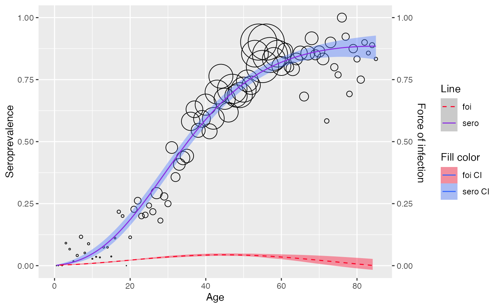
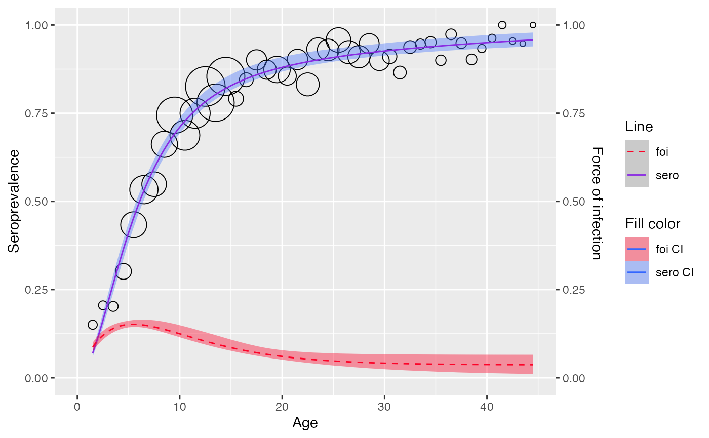
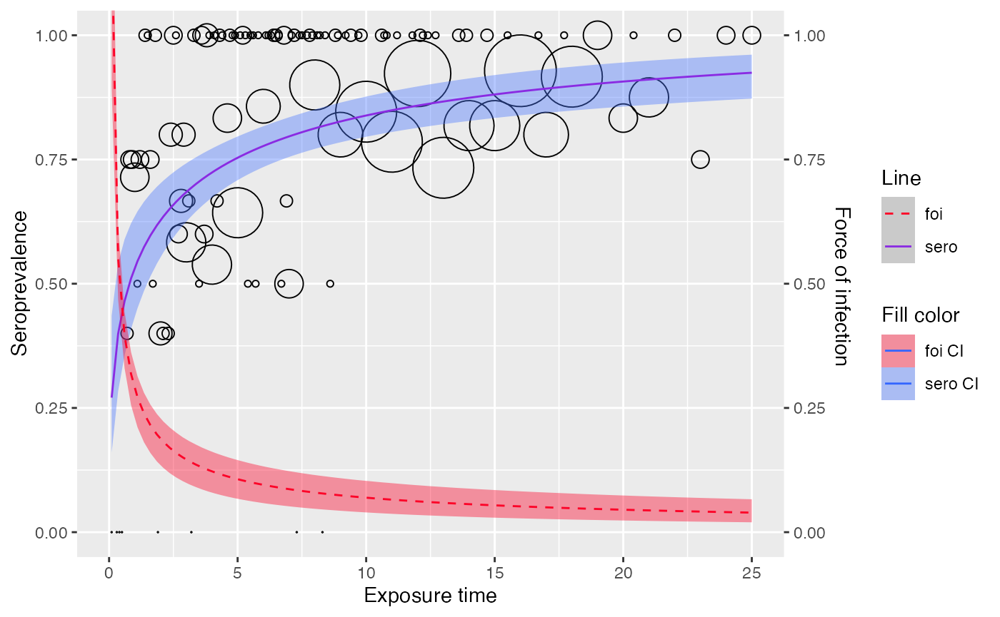
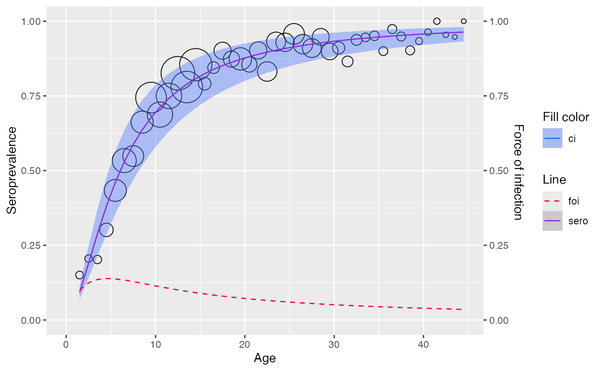
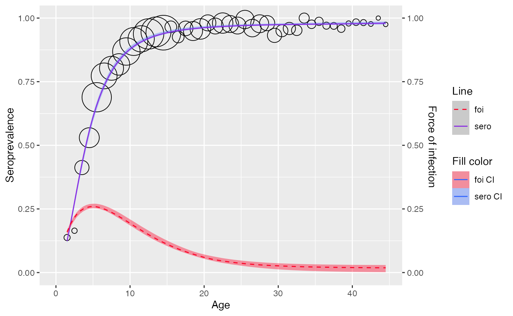

# Parametric models

``` r
library(serosv)
library(dplyr)
library(magrittr)
```

## Frequentist methods

### Polynomial models

Seroprevalence is modeled using the following serocatalytic model

\\\[ \pi(a) = 1 - \text{exp}({-\Sigma\_{i=1}^k \beta_i a^i}) \\\]

Where:

- \\(a\\) is the variable age

- \\(\pi\\) is the seroprevalence of the population at age \\(a\\)

- \\(k\\) is the degree of the polynomial

- \\(\beta_i\\) are the model parameters

Which implies the force of infection is \\(\lambda(a) = \Sigma\_{i=1}^k
\beta_i i a^{i-1}\\)

This generalization encompasses several classical serocatalytic model
including

- **Muench model** (assuming \\(k=1\\)) ([Muench
  1934](#ref-muench_derivation_1934))

- **Griffith model** (assuming \\(k = 2\\))

- **Grenfell and Anderson model** (assuming higher degree \\(k\\))
  ([Grenfell and Anderson 1985](#ref-grenfell_estimation_1985))

Refer to `Chapter 6.1.1` of the book by Hens et al.
([2012](#ref-Hens2012)) for a more detailed explanation of the methods.

**Fitting data**

We will use the `Parvo B19` data from Finland 1997–1998 for this
example.

``` r
data <- parvob19_fi_1997_1998[order(parvob19_fi_1997_1998$age), ]
```

To fit a polynomial model, use the
[`polynomial_model()`](https://oucru-modelling.github.io/serosv/reference/polynomial_model.md)
function.

``` r
# Fit a Muench model
muench <- polynomial_model(data, k = 1, status_col = "seropositive")
summary(muench$info)
#> 
#> Call:
#> glm(formula = Age(k), family = binomial(link = link), data = df)
#> 
#> Coefficients:
#>      Estimate Std. Error z value Pr(>|z|)    
#> age -0.029088   0.001375  -21.15   <2e-16 ***
#> ---
#> Signif. codes:  0 '***' 0.001 '**' 0.01 '*' 0.05 '.' 0.1 ' ' 1
#> 
#> (Dispersion parameter for binomial family taken to be 1)
#> 
#>     Null deviance:    Inf  on 1117  degrees of freedom
#> Residual deviance: 1366.9  on 1116  degrees of freedom
#> AIC: 1368.9
#> 
#> Number of Fisher Scoring iterations: 6
plot(muench) 
```


The users can also choose to provide a range of values for \\(k\\) in
which case the package will try to find the best \\(k\\) parameter
determined by Loglikelihood Ratio test (LRT)

``` r
# Provide a range of values for k
best_param <- polynomial_model(data, k = 1:5, status_col = "seropositive")
plot(best_param)
```


``` r

# View the best model here which suggests k = 4 is the best parameter value
best_param$info
#> 
#> Call:  glm(formula = Age(k), family = binomial(link = link), data = df)
#> 
#> Coefficients:
#>        age    I(age^2)    I(age^3)    I(age^4)  
#> -3.381e-02  -9.950e-04   5.551e-05  -5.737e-07  
#> 
#> Degrees of Freedom: 1117 Total (i.e. Null);  1113 Residual
#> Null Deviance:       Inf 
#> Residual Deviance: 1336  AIC: 1344
```

------------------------------------------------------------------------

### Fractional polynomial model

**Proposed model**

Fractional polynomial model generalize conventional polynomial class of
functions. In the context of binary responses, a fractional polynomial
of degree \\(m\\) for the linear predictor is defined as followed

\\\[ \eta_m(a, \beta, p_1, p_2, ...,p_m) = \Sigma^m\_{i=0} \beta_i
H_i(a) \\\]

Where \\(m\\) is an integer, \\(p_1 \le p_2 \le... \le p_m\\) is a
sequence of powers, and \\(H_i(a)\\) is a transformation given by

\\\[ H_i = \begin{cases} a^{p_i} & \text{ if } p_i \neq p\_{i-1}, \\\\
H\_{i-1}(a) \times log(a) & \text{ if } p_i = p\_{i-1}, \end{cases} \\\]

Refer to `Chapter 6.2` of the book by Hens et al.
([2012](#ref-Hens2012)) for a more detailed explanation of the methods.

**Fitting data**

Use
[`fp_model()`](https://oucru-modelling.github.io/serosv/reference/fp_model.md)
to fit a fractional polynomial model.

The parameter `p` specifies the powers of each polynomial term (length
of `p` is thus the model’s degree)

``` r
hav <- hav_be_1993_1994
model <- fp_model(hav, p=c(1, 1.5), link="cloglog")
plot(model)
```


The users can also tell the package to perform parameter selection by
providing `p` as a named list with 2 elements:

- `degree` the maximum number of terms to search over

&nbsp;

- `p_range` the possible powers for each term

``` r
model <- fp_model(hav, 
                  p=list(
                    p_range=seq(-2,3,0.1),
                    degree=2
                  ), 
                  monotonic=FALSE,
                  link="cloglog")
plot(model)
```


``` r
# the best set of powers for this dataset is 1.5 and 1.6
model$info
#> 
#> Call:  glm(formula = as.formula(formulate(curr_p)), family = binomial(link = link))
#> 
#> Coefficients:
#> (Intercept)   I(age^1.5)   I(age^1.6)  
#>    -3.61083      0.12443     -0.07656  
#> 
#> Degrees of Freedom: 85 Total (i.e. Null);  83 Residual
#> Null Deviance:       1320 
#> Residual Deviance: 81.6  AIC: 361.2
```

To restrict the parameters search such that the predictions are
monotonic (thus ensuring the FOI to be \\(\lambda \geq 0\\)) set
`monotonic=TRUE`

``` r
# ---- Best model with the monotonic constraint -----
model <- fp_model(hav, 
                  p=list(
                    p_range=seq(-2,3,0.1),
                    degree=2
                  ), 
                  monotonic=TRUE,
                  link="cloglog")
plot(model)
```



``` r
# the best set of powers with the monotonic constraint is 0.5 and 1.1
model$info
#> 
#> Call:  glm(formula = as.formula(formulate(curr_p)), family = binomial(link = link))
#> 
#> Coefficients:
#> (Intercept)   I(age^0.5)   I(age^1.1)  
#>    -7.64170      1.67492     -0.05304  
#> 
#> Degrees of Freedom: 85 Total (i.e. Null);  83 Residual
#> Null Deviance:       1320 
#> Residual Deviance: 106   AIC: 385.5
```

------------------------------------------------------------------------

### Nonlinear models

#### Farrington model

**Proposed model**

For Farrington’s model, the force of infection was defined non-negative
for all a \\(\lambda(a) \geq 0\\) and increases to a peak in a linear
fashion followed by an exponential decrease

\\\[ \lambda(a) = (\alpha a - \gamma)e^{-\beta a} + \gamma \\\]

Where \\(\gamma\\) is called the long term residual for FOI, as \\(a
\rightarrow \infty\\) , \\(\lambda (a) \rightarrow \gamma\\)

Integrating \\(\lambda(a)\\) would results in the following non-linear
model for prevalence

\\\[ \pi (a) = 1 - e^{-\int_0^a \lambda(s) ds} \\\\ = 1 - exp\\{
\frac{\alpha}{\beta}ae^{-\beta a} +
\frac{1}{\beta}(\frac{\alpha}{\beta} - \gamma)(e^{-\beta a} - 1) -\gamma
a \\} \\\]

Refer to `Chapter 6.1.2` of the book by Hens et al.
([2012](#ref-Hens2012)) for a more detailed explanation of the methods.

**Fitting data**

Use
[`farrington_model()`](https://oucru-modelling.github.io/serosv/reference/farrington_model.md)
to fit a **Farrington**’s model.

``` r
farrington_md <- farrington_model(
   rubella_uk_1986_1987,
   start=list(alpha=0.07,beta=0.1,gamma=0.03)
   )
plot(farrington_md)
```



#### Weibull model

**Proposed model**

For a Weibull model, the prevalence is given by

\\\[ \pi (d) = 1 - e^{ - \beta_0 d ^ {\beta_1}} \\\]

Where \\(d\\) is exposure time (difference between age of injection and
age at test)

The model was reformulated as a GLM model with log - log link and linear
predictor using log(d)

\\\[\eta(d) = log(\beta_0) + \beta_1 log(d)\\\]

Thus implies that the force of infection is a monotone function of the
exposure time as followed

\\\[ \lambda(d) = \beta_0 \beta_1 d^{\beta_1 - 1} \\\]

Refer to `Chapter 6.1.2` of the book by Hens et al.
([2012](#ref-Hens2012)) for a more detailed explanation of the methods.

**Fitting data**

Use
[`weibull_model()`](https://oucru-modelling.github.io/serosv/reference/weibull_model.md)
to fit a Weibull model.

``` r
hcv <- hcv_be_2006[order(hcv_be_2006$dur), ]

wb_md <- hcv %>% weibull_model(t_lab = "dur", status_col="seropositive")
plot(wb_md) 
```



## Bayesian methods

**Proposed approach**

Consider a model for prevalence that has a parametric form \\(\pi(a_i,
\alpha)\\) where \\(\alpha\\) is a parameter vector

One can constraint the parameter space of the prior distribution
\\(P(\alpha)\\) in order to achieve the desired monotonicity of the
posterior distribution \\(P(\pi_1, \pi_2, ..., \pi_m\|y,n)\\)

Where:

- \\(n = (n_1, n_2, ..., n_m)\\) and \\(n_i\\) is the sample size at age
  \\(a_i\\)

- \\(y = (y_1, y_2, ..., y_m)\\) and \\(y_i\\) is the number of infected
  individual from the \\(n_i\\) sampled subjects

### Farrington

**Proposed model**

The model for prevalence is as followed

\\\[ \pi (a) = 1 - exp\\{ \frac{\alpha_1}{\alpha_2}ae^{-\alpha_2 a} +
\frac{1}{\alpha_2}(\frac{\alpha_1}{\alpha_2} - \alpha_3)(e^{-\alpha_2
a} - 1) -\alpha_3 a \\} \\\]

For likelihood model, independent binomial distribution are assumed for
the number of infected individuals at age \\(a_i\\)

\\\[ y_i \sim Bin(n_i, \pi_i), \text{ for } i = 1,2,3,...m \\\]

The constraint on the parameter space can be incorporated by assuming
truncated normal distribution for the components of \\(\alpha\\),
\\(\alpha = (\alpha_1, \alpha_2, \alpha_3)\\) in \\(\pi_i =
\pi(a_i,\alpha)\\)

\\\[ \alpha_j \sim \text{truncated } \mathcal{N}(\mu_j, \tau_j), \text{
} j = 1,2,3 \\\]

The joint posterior distribution for \\(\alpha\\) can be derived by
combining the likelihood and prior as followed

\\\[ P(\alpha\|y) \propto \prod^m\_{i=1} \text{Bin}(y_i\|n_i, \pi(a_i,
\alpha)) \prod^3\_{i=1}-\frac{1}{\tau_j}\text{exp}(\frac{1}{2\tau^2_j}
(\alpha_j - \mu_j)^2) \\\]

- Where the flat hyperprior distribution is defined as followed:

  - \\(\mu_j \sim \mathcal{N}(0, 10000)\\)

  - \\(\tau^{-2}\_j \sim \Gamma(100,100)\\)

The full conditional distribution of \\(\alpha_i\\) is thus \\\[
P(\alpha_i\|\alpha_j,\alpha_k, k, j \neq i) \propto
-\frac{1}{\tau_i}\text{exp}(\frac{1}{2\tau^2_i} (\alpha_i - \mu_i)^2)
\prod^m\_{i=1} \text{Bin}(y_i\|n_i, \pi(a_i, \alpha)) \\\]

Refer to `Chapter 10.3.1` of the book by Hens et al.
([2012](#ref-Hens2012)) for a more detailed explanation of the method.

**Fitting data**

To fit Farrington model, use
[`hierarchical_bayesian_model()`](https://oucru-modelling.github.io/serosv/reference/hierarchical_bayesian_model.md)
and define `type = "far2"` or `type = "far3"` where

- `type = "far2"` refers to Farrington model with 2 parameters
  (\\(\alpha_3 = 0\\))

- `type = "far3"` refers to Farrington model with 3 parameters
  (\\(\alpha_3 \> 0\\))

``` r
df <- mumps_uk_1986_1987
model <- hierarchical_bayesian_model(df, type="far3")
#> 
#> SAMPLING FOR MODEL 'fra_3' NOW (CHAIN 1).
#> Chain 1: Rejecting initial value:
#> Chain 1:   Log probability evaluates to log(0), i.e. negative infinity.
#> Chain 1:   Stan can't start sampling from this initial value.
#> Chain 1: 
#> Chain 1: Gradient evaluation took 0.000159 seconds
#> Chain 1: 1000 transitions using 10 leapfrog steps per transition would take 1.59 seconds.
#> Chain 1: Adjust your expectations accordingly!
#> Chain 1: 
#> Chain 1: 
#> Chain 1: Iteration:    1 / 5000 [  0%]  (Warmup)
#> Chain 1: Iteration:  500 / 5000 [ 10%]  (Warmup)
#> Chain 1: Iteration: 1000 / 5000 [ 20%]  (Warmup)
#> Chain 1: Iteration: 1500 / 5000 [ 30%]  (Warmup)
#> Chain 1: Iteration: 1501 / 5000 [ 30%]  (Sampling)
#> Chain 1: Iteration: 2000 / 5000 [ 40%]  (Sampling)
#> Chain 1: Iteration: 2500 / 5000 [ 50%]  (Sampling)
#> Chain 1: Iteration: 3000 / 5000 [ 60%]  (Sampling)
#> Chain 1: Iteration: 3500 / 5000 [ 70%]  (Sampling)
#> Chain 1: Iteration: 4000 / 5000 [ 80%]  (Sampling)
#> Chain 1: Iteration: 4500 / 5000 [ 90%]  (Sampling)
#> Chain 1: Iteration: 5000 / 5000 [100%]  (Sampling)
#> Chain 1: 
#> Chain 1:  Elapsed Time: 16.768 seconds (Warm-up)
#> Chain 1:                96.491 seconds (Sampling)
#> Chain 1:                113.259 seconds (Total)
#> Chain 1:
#> Warning: There were 288 divergent transitions after warmup. See
#> https://mc-stan.org/misc/warnings.html#divergent-transitions-after-warmup
#> to find out why this is a problem and how to eliminate them.
#> Warning: There were 11 transitions after warmup that exceeded the maximum treedepth. Increase max_treedepth above 10. See
#> https://mc-stan.org/misc/warnings.html#maximum-treedepth-exceeded
#> Warning: Examine the pairs() plot to diagnose sampling problems
#> Warning: Tail Effective Samples Size (ESS) is too low, indicating posterior variances and tail quantiles may be unreliable.
#> Running the chains for more iterations may help. See
#> https://mc-stan.org/misc/warnings.html#tail-ess

model$info
#>                       mean      se_mean           sd          2.5%
#> alpha1        1.396732e-01 2.328172e-04 5.926643e-03  1.290067e-01
#> alpha2        1.989632e-01 3.342249e-04 8.454176e-03  1.847781e-01
#> alpha3        9.017286e-03 2.957517e-04 7.503320e-03  2.519932e-04
#> tau_alpha1    2.051039e+00 2.925237e-01 5.992958e+00  1.814318e-06
#> tau_alpha2    4.280878e+00 1.545375e+00 1.261621e+01  5.514011e-06
#> tau_alpha3    1.594944e+00 2.713658e-01 4.513571e+00  1.717967e-06
#> mu_alpha1    -2.434489e+00 4.143249e+00 4.467754e+01 -1.656101e+02
#> mu_alpha2    -9.043922e-01 1.406475e+00 3.373188e+01 -9.031034e+01
#> mu_alpha3     2.147579e+00 1.666808e+00 4.272829e+01 -9.818932e+01
#> sigma_alpha1  9.673678e+03 9.523462e+03 2.012224e+05  2.027127e-01
#> sigma_alpha2  8.037575e+01 1.664371e+01 5.816331e+02  1.342710e-01
#> sigma_alpha3  1.665419e+02 4.235920e+01 1.470059e+03  2.354869e-01
#> lp__         -2.534311e+03 2.684310e-01 4.176499e+00 -2.542650e+03
#>                        25%           50%           75%         97.5%      n_eff
#> alpha1        1.353546e-01  1.393536e-01  1.435425e-01  1.520502e-01  648.01829
#> alpha2        1.931939e-01  1.981250e-01  2.037919e-01  2.181404e-01  639.83066
#> alpha3        3.301399e-03  6.948630e-03  1.310897e-02  2.798314e-02  643.65402
#> tau_alpha1    4.699710e-04  1.339575e-02  4.377299e-01  2.433537e+01  419.72073
#> tau_alpha2    1.099782e-03  3.547442e-02  9.730938e-01  5.546799e+01   66.64842
#> tau_alpha3    3.847899e-04  1.424805e-02  4.511886e-01  1.803311e+01  276.64990
#> mu_alpha1    -4.777740e+00  1.761566e-01  4.990839e+00  8.616947e+01  116.27771
#> mu_alpha2    -3.043304e+00  1.912986e-01  2.809284e+00  6.930927e+01  575.19790
#> mu_alpha3    -4.356601e+00  8.834931e-02  7.109717e+00  1.097394e+02  657.14323
#> sigma_alpha1  1.511461e+00  8.640059e+00  4.612799e+01  7.424105e+02  446.43988
#> sigma_alpha2  1.013731e+00  5.309408e+00  3.015428e+01  4.258861e+02 1221.23065
#> sigma_alpha3  1.488748e+00  8.377652e+00  5.097869e+01  7.629637e+02 1204.40906
#> lp__         -2.537035e+03 -2.534291e+03 -2.531361e+03 -2.526569e+03  242.08025
#>                   Rhat
#> alpha1       1.0006390
#> alpha2       0.9997486
#> alpha3       0.9999655
#> tau_alpha1   1.0023789
#> tau_alpha2   1.0060590
#> tau_alpha3   1.0005442
#> mu_alpha1    1.0039620
#> mu_alpha2    0.9997144
#> mu_alpha3    1.0015442
#> sigma_alpha1 1.0019918
#> sigma_alpha2 1.0000931
#> sigma_alpha3 0.9997146
#> lp__         1.0215691
plot(model)
```



### Log-logistic

**Proposed approach**

The model for seroprevalence is as followed

\\\[ \pi(a) = \frac{\beta a^\alpha}{1 + \beta a^\alpha}, \text{ }
\alpha, \beta \> 0 \\\]

The likelihood is specified to be the same as Farrington model (\\(y_i
\sim Bin(n_i, \pi_i)\\)) with

\\\[ \text{logit}(\pi(a)) = \alpha_2 + \alpha_1\log(a) \\\]

- Where \\(\alpha_2 = \text{log}(\beta)\\)

The prior model of \\(\alpha_1\\) is specified as \\(\alpha_1 \sim
\text{truncated } \mathcal{N}(\mu_1, \tau_1)\\) with flat hyperprior as
in Farrington model

\\(\beta\\) is constrained to be positive by specifying \\(\alpha_2 \sim
\mathcal{N}(\mu_2, \tau_2)\\)

The full conditional distribution of \\(\alpha_1\\) is thus

\\\[ P(\alpha_1\|\alpha_2) \propto -\frac{1}{\tau_1} \text{exp}
(\frac{1}{2 \tau_1^2} (\alpha_1 - \mu_1)^2) \prod\_{i=1}^m
\text{Bin}(y_i\|n_i,\pi(a_i, \alpha_1, \alpha_2) ) \\\]

And \\(\alpha_2\\) can be derived in the same way

Refer to `Chapter 10.3.3` of the book by Hens et al.
([2012](#ref-Hens2012)) for a more detailed explanation of the method.

**Fitting data**

To fit Log-logistic model, use
[`hierarchical_bayesian_model()`](https://oucru-modelling.github.io/serosv/reference/hierarchical_bayesian_model.md)
and define `type = "log_logistic"`

``` r
df <- rubella_uk_1986_1987
model <- hierarchical_bayesian_model(df, type="log_logistic")
#> 
#> SAMPLING FOR MODEL 'log_logistic' NOW (CHAIN 1).
#> Chain 1: 
#> Chain 1: Gradient evaluation took 6.7e-05 seconds
#> Chain 1: 1000 transitions using 10 leapfrog steps per transition would take 0.67 seconds.
#> Chain 1: Adjust your expectations accordingly!
#> Chain 1: 
#> Chain 1: 
#> Chain 1: Iteration:    1 / 5000 [  0%]  (Warmup)
#> Chain 1: Iteration:  500 / 5000 [ 10%]  (Warmup)
#> Chain 1: Iteration: 1000 / 5000 [ 20%]  (Warmup)
#> Chain 1: Iteration: 1500 / 5000 [ 30%]  (Warmup)
#> Chain 1: Iteration: 1501 / 5000 [ 30%]  (Sampling)
#> Chain 1: Iteration: 2000 / 5000 [ 40%]  (Sampling)
#> Chain 1: Iteration: 2500 / 5000 [ 50%]  (Sampling)
#> Chain 1: Iteration: 3000 / 5000 [ 60%]  (Sampling)
#> Chain 1: Iteration: 3500 / 5000 [ 70%]  (Sampling)
#> Chain 1: Iteration: 4000 / 5000 [ 80%]  (Sampling)
#> Chain 1: Iteration: 4500 / 5000 [ 90%]  (Sampling)
#> Chain 1: Iteration: 5000 / 5000 [100%]  (Sampling)
#> Chain 1: 
#> Chain 1:  Elapsed Time: 4.195 seconds (Warm-up)
#> Chain 1:                5.814 seconds (Sampling)
#> Chain 1:                10.009 seconds (Total)
#> Chain 1:
#> Warning: There were 583 divergent transitions after warmup. See
#> https://mc-stan.org/misc/warnings.html#divergent-transitions-after-warmup
#> to find out why this is a problem and how to eliminate them.
#> Warning: Examine the pairs() plot to diagnose sampling problems
#> Warning: Bulk Effective Samples Size (ESS) is too low, indicating posterior means and medians may be unreliable.
#> Running the chains for more iterations may help. See
#> https://mc-stan.org/misc/warnings.html#bulk-ess
#> Warning: Tail Effective Samples Size (ESS) is too low, indicating posterior variances and tail quantiles may be unreliable.
#> Running the chains for more iterations may help. See
#> https://mc-stan.org/misc/warnings.html#tail-ess

model$type
#> [1] "log_logistic"
plot(model)
```



Grenfell, B. T., and R. M. Anderson. 1985. “The Estimation of
Age-Related Rates of Infection from Case Notifications and Serological
Data.” *The Journal of Hygiene* 95 (2): 419–36.
<https://doi.org/10.1017/s0022172400062859>.

Hens, Niel, Ziv Shkedy, Marc Aerts, Christel Faes, Pierre Van Damme, and
Philippe Beutels. 2012. *Modeling Infectious Disease Parameters Based on
Serological and Social Contact Data: A Modern Statistical Perspective*.
*Statistics for Biology and Health*. Springer New York.
<https://doi.org/10.1007/978-1-4614-4072-7>.

Muench, Hugo. 1934. “Derivation of Rates from Summation Data by the
Catalytic Curve.” *Journal of the American Statistical Association* 29
(185): 25–38. <https://doi.org/10.1080/01621459.1934.10502684>.
