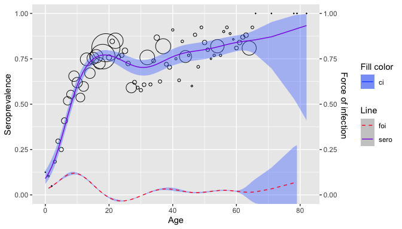

# Semiparametric model

``` r
library(serosv)
library(dplyr)
#> Warning: package 'dplyr' was built under R version 4.3.1
#> 
#> Attaching package: 'dplyr'
#> The following objects are masked from 'package:stats':
#> 
#>     filter, lag
#> The following objects are masked from 'package:base':
#> 
#>     intersect, setdiff, setequal, union
```

## Penalized splines

**Proposed model**

` Penalized splines `

A general model relating the prevalence to age can be written as a GLM

\\\[ g(P(Y_i = 1\| a \_i)) = g(\pi(a_i)) = \eta(a_i) \\\]

- Where \\(g\\) is the link function and \\(\eta\\) is the linear
  predictor

The linear predictor can be estimated semi-parametrically using
penalized spline with truncated power basis functions of degree \\(p\\)
and fixed knots \\(\kappa_1,..., \kappa_k\\) as followed

\\\[ \eta(a_i) = \beta_0 + \beta_1a_i + ... + \beta_p a_i^p +
\Sigma\_{k=1}^ku_k(a_i - \kappa_k)^p\_+ \\\]

- Where

  \\\[ (a_i - \kappa_k)^p\_+ = \begin{cases} 0, & a_i \le \kappa_k \\\\
  (a_i - \kappa_k)^p, & a_i \> \kappa_k \end{cases} \\\]

In matrix notation, the mean structure model for \\(\eta(a_i)\\) becomes

\\\[ \eta = X\beta + Zu \\\]

Where \\(\eta = \[\eta(a_i) ... \eta(a_N) \]^T\\), \\(\beta = \[\beta_0
\beta_1 .... \beta_p\]^T\\), and \\(u = \[u_1 u_2 ... u_k\]^T\\) are the
regression with corresponding design matrices

\\\[ X = \begin{bmatrix} 1 & a_1 & a_1^2 & ... & a_1^p \\\\ 1 & a_2 &
a_2^2 & ... & a_2^p \\\\ \vdots & \vdots & \vdots & \dots & \vdots \\\\
1 & a_N & a_N^2 & ... & a_N^p \end{bmatrix}, Z = \begin{bmatrix} (a_1 -
\kappa_1 )\_+^p & (a_1 - \kappa_2 )\_+^p & \dots & (a_1 - \kappa_k)\_+^p
\\\\ (a_2 - \kappa_1 )\_+^p & (a_2 - \kappa_2 )\_+^p & \dots & (a_2 -
\kappa_k)\_+^p \\\\ \vdots & \vdots & \dots & \vdots \\\\ (a_N -
\kappa_1 )\_+^p & (a_N - \kappa_2 )\_+^p & \dots & (a_N - \kappa_k)\_+^p
\end{bmatrix} \\\]

FOI can then be derived as

\\\[ \hat{\lambda}(a_i) = \[\hat{\beta_1} , 2\hat{\beta_2}a_i, ..., p
\hat{\beta} a_i ^{p-1} + \Sigma^k\_{k=1} p \hat{u}\_k(a_i -
\kappa_k)^{p-1}\_+\] \delta(\hat{\eta}(a_i)) \\\]

- Where \\(\delta(.)\\) is determined by the link function use in the
  model

------------------------------------------------------------------------

### Penalized likelihood framework

Refer to Chapter `8.2.1` of the book by Hens et al.
([2012](#ref-Hens2012)) for a more detailed explanation of the method.

**Proposed approach**

A first approach to fit the model is by maximizing the following
penalized likelihood

\\\[\begin{equation} \phi^{-1}\[y^T(X\beta + Zu ) - 1^Tc(X\beta + Zu
)\] - \frac{1}{2}\lambda^2 \begin{bmatrix} \beta \\\u \end{bmatrix}^T
D\begin{bmatrix} \beta \\\u \end{bmatrix} \tag{1} \end{equation}\\\]

Where:

- \\(X\beta + Zu\\) is the linear predictor

- \\(D\\) is a known semi-definite penalty matrix ([Wahba
  1978](#ref-Wahba1978)), ([Green and Silverman 1993](#ref-Green1993))

- \\(y\\) is the response vector

- 1 the unit vector, \\(c(.)\\) is determined by the link function used

- \\(\lambda\\) is the smoothing parameter (larger values –\> smoother
  curves)

- \\(\phi\\) is the overdispersion parameter and equals 1 if there is no
  overdispersion

**Fitting data**

To fit the data using the penalized likelihood framework, specify
`framework = "pl"`

Basis function can be defined via the `s` parameter, some values for s
includes:

- `"tp"` thin plate regression splines

- `"cr"` cubic regression splines

- `"ps"` P-splines proposed by ([Eilers and Marx 1996](#ref-Eilers1996))

- `"ad"` for Adaptive smoothers

For more options, refer to the [mgcv
documentation](https://stat.ethz.ch/R-manual/R-devel/library/mgcv/html/smooth.terms.html)
([Wood 2017](#ref-Wood2017))

``` r
pl <- parvob19_be_2001_2003 %>% 
  rename(status = seropositive) %>% 
  penalized_spline_model(s = "tp", framework = "pl") 
pl$info
#> 
#> Family: binomial 
#> Link function: logit 
#> 
#> Formula:
#> spos ~ s(age, bs = s, sp = sp)
#> 
#> Estimated degrees of freedom:
#> 6.16  total = 7.16 
#> 
#> UBRE score: 0.1206458
```

``` r
plot(pl)
```



------------------------------------------------------------------------

### Generalized Linear Mixed Model framework

Refer to Chapter `8.2.2` of the book by Hens et al.
([2012](#ref-Hens2012)) for a more detailed explanation of the method.

**Proposed approach**

Looking back at [(1)](#eq:penlikelihood), a constraint for \\(u\\) would
be \\(\Sigma_ku_k^2 \< C\\) for some positive value \\(C\\)

This is equivalent to choosing \\((\beta, u)\\) to maximise
[(1)](#eq:penlikelihood) with \\(D = diag(0, 1)\\) where \\(0\\) denotes
zero vector length \\(p+1\\) and 1 denotes the unit vector of length
\\(K\\)

For a fixed value for \\(\lambda\\) this is equivalent to fitting the
following generalized linear mixed model Ngo and Wand
([2004](#ref-Ngo2004))

\\\[ f(y\|u) = exp\\{ \phi^{-1} \[y^T(X\beta + Zu) - c(X\beta + Zu)\] +
1^Tc(y)\\},\\\\ u \sim N(0, G) \\\]

- With similar notations as before and \\(G = \sigma^2_uI\_{K \times
  K}\\)

Thus \\(Z\\) is penalized by assuming the corresponding coefficients
\\(u\\) are random effect with \\(u \sim N(0, \sigma^2_uI)\\).

**Fitting data**

To fit the data using the penalized likelihood framework, specify
`framework = "glmm"`

``` r
glmm <- parvob19_be_2001_2003 %>% 
  rename(status = seropositive) %>% 
  penalized_spline_model(s = "tp", framework = "glmm") 
#> 
#>  Maximum number of PQL iterations:  20
#> iteration 1
#> iteration 2
#> iteration 3
#> iteration 4
glmm$info$gam
#> 
#> Family: binomial 
#> Link function: logit 
#> 
#> Formula:
#> spos ~ s(age, bs = s, sp = sp)
#> 
#> Estimated degrees of freedom:
#> 6.45  total = 7.45
```

``` r
plot(glmm)
```


Eilers, Paul H. C., and Brian D. Marx. 1996. “Flexible Smoothing with
b-Splines and Penalties.” *Statistical Science* 11 (2).
<https://doi.org/10.1214/ss/1038425655>.

Green, P. J., and Bernard. W. Silverman. 1993. *Nonparametric Regression
and Generalized Linear Models: A Roughness Penalty Approach*. Chapman;
Hall/CRC. <https://doi.org/10.1201/b15710>.

Hens, Niel, Ziv Shkedy, Marc Aerts, Christel Faes, Pierre Van Damme, and
Philippe Beutels. 2012. *Modeling Infectious Disease Parameters Based on
Serological and Social Contact Data: A Modern Statistical Perspective*.
*Statistics for Biology and Health*. Springer New York.
<https://doi.org/10.1007/978-1-4614-4072-7>.

Ngo, Long, and Matthew P. Wand. 2004. “Smoothing with Mixed Model
Software.” *Journal of Statistical Software* 9 (1).
<https://doi.org/10.18637/jss.v009.i01>.

Ruppert, David, M. P. Wand, and R. J. Carroll. 2003. *Semiparametric
Regression*. Cambridge University Press.
<https://doi.org/10.1017/cbo9780511755453>.

Wahba, Grace. 1978. “Improper Priors, Spline Smoothing and the Problem
of Guarding Against Model Errors in Regression.” *Journal of the Royal
Statistical Society Series B: Statistical Methodology* 40 (3): 364–72.
<https://doi.org/10.1111/j.2517-6161.1978.tb01050.x>.

Wand, M. P. 2003. “Smoothing and Mixed Models.” *Computational
Statistics* 18 (2): 223–49. <https://doi.org/10.1007/s001800300142>.

Wood, Simon N. 2017. *Generalized Additive Models: An Introduction with
r*. Chapman; Hall/CRC. <https://doi.org/10.1201/9781315370279>.
