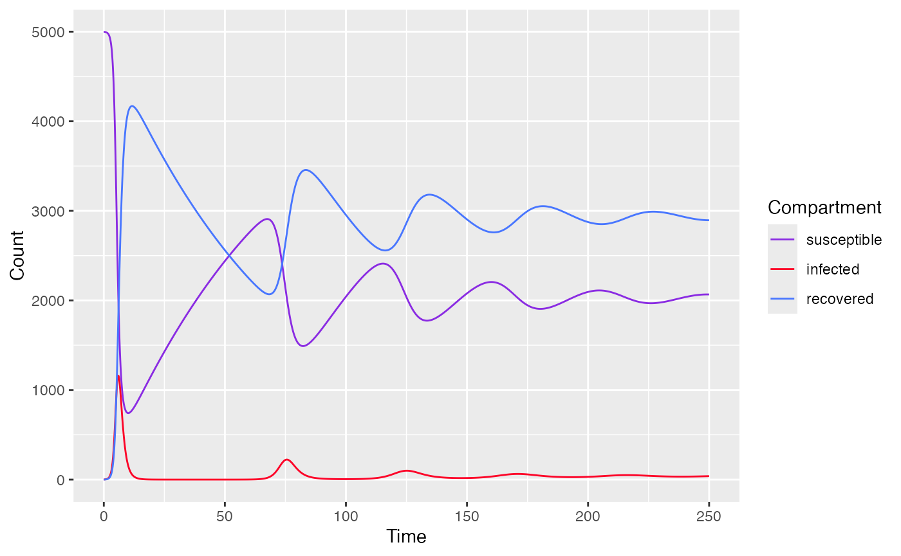
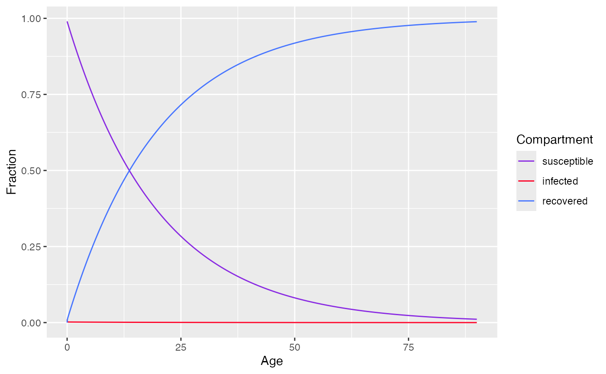
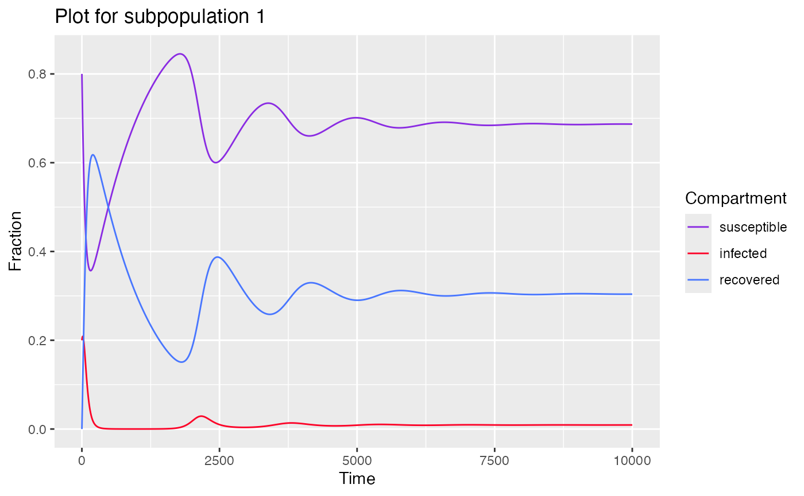
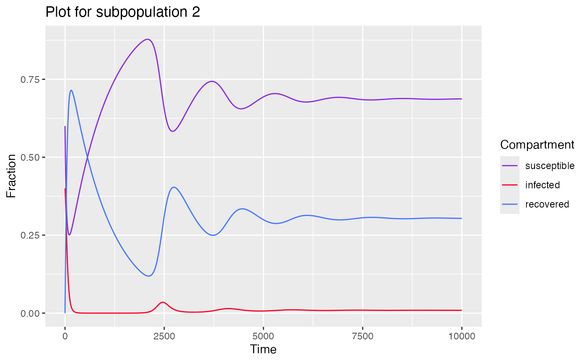
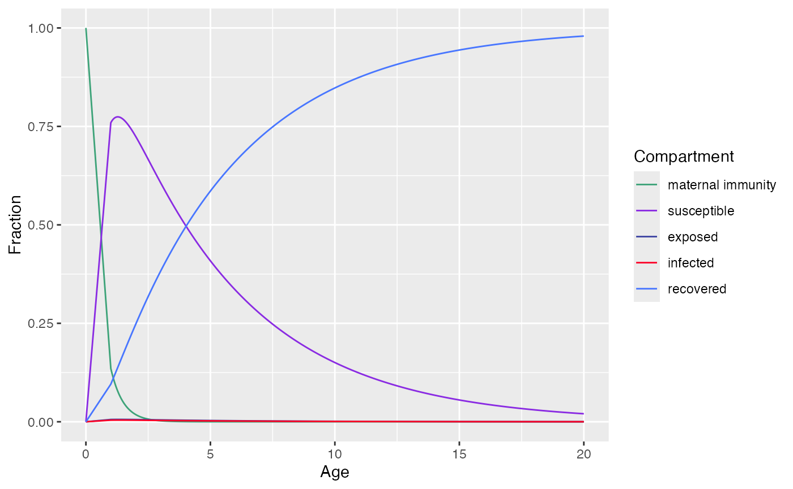

# SIR model

``` r
library(serosv)
```

## Basic SIR model

**Proposed model**

Let’s consider a transmission model consists of 3 compartments:
susceptible (S), infected (I), recovered (R)

With the following assumptions:

- Individuals are born into susceptible group (exposure time is age of
  the individual) then transfer to infected class and recovered class

- Recovered individuals gained lifelong immunity

- Age homogeneity

And described by a system of 3 differential equations

$$\left\{ \begin{array}{l}
{\frac{dS(t)}{dt} = B(t)(1 - p) - \lambda(t)S(t) - \mu S(t)} \\
{\frac{dI(t)}{dt} = \lambda(t)S(t) - \nu I(t) - \mu I(t) - \alpha I(t)} \\
{\frac{dR(t)}{dt} = B(t)p + \nu I(t) - \mu R(t)} \\
\end{array} \right.$$

Where:

- $B(t) = \mu N(t)$
- $\lambda(t) = \beta I(t)$ with $\beta$ is the transmission rate
- $\mu$ is the natural death rate
- $\nu$ is the recovery rate
- $\alpha$ is the disease related death rate
- $p$ is the proportion of newborn vaccinated and moved directly to the
  recovered compartment

**Simulating data**

To simulate a basic SIR model, use
[`sir_basic_model()`](https://oucru-modelling.github.io/serosv/reference/sir_basic_model.md)
and specify the following parameters

- `state` - initial population of each compartment

- `times` - a time sequence

- `parameters` - parameters for SIR model

``` r
state <- c(S=4999, I=1, R=0)
parameters <- c(
  mu=1/75, # 1 divided by life expectancy (75 years old)
  alpha=0, # no disease-related death
  beta=0.0005, # transmission rate
  nu=1, # 1 year for infected to recover
  p=0 # no vaccination at birth
)
times <- seq(0, 250, by=0.1)
model <- sir_basic_model(times, state, parameters)
model$parameters
#>         mu      alpha       beta         nu          p 
#> 0.01333333 0.00000000 0.00050000 1.00000000 0.00000000
plot(model)
```



## SIR model with constant Force of Infection at Endemic state

**Proposed model**

Let’s consider a transmission model consists of 3 compartments:
susceptible (S), infected (I), recovered (R)

With the following assumptions:

- Time homogeneity

- Age heterogeneity

Described by a system of 3 differential equations

$$\left\{ \begin{array}{l}
{\frac{ds(a)}{da} = - \lambda s(a)} \\
{\frac{di(a)}{da} = \lambda s(a) - \nu i(a)} \\
{\frac{dr(a)}{da} = \nu i(a)} \\
\end{array} \right.$$

Where:

- $s(a),i(a),r(a)$ are proportion of susceptible, infected, recovered
  population of age group $a$ respectively
- $\lambda$ is the force of infection
- $\nu$ is the recovery rate

**Simulating data**

To simulate an SIR model with constant FOI, use
[`sir_static_model()`](https://oucru-modelling.github.io/serosv/reference/sir_static_model.md)
and specify the following parameters

- `state` - initial proportion of each compartment

- `ages` - an age sequence

- `parameters` - parameters for the model

``` r
state <- c(s=0.99,i=0.01,r=0)
parameters <- c(
  lambda = 0.05,
  nu=1/(14/365) # 2 weeks to recover
)
ages<-seq(0, 90, by=0.01)
model <- sir_static_model(ages, state, parameters)
model$parameters
#>   lambda       nu 
#>  0.05000 26.07143
plot(model)
```



## SIR model with sub populations

**Proposed model**

Extends on the SIR model by having interacting sub-populations
(different age groups)

With K subpopulations, the WAIFW matrix or mixing matrix is given by

$$C = \begin{bmatrix}
\beta_{11} & \beta_{12} & {...} & \beta_{1K} \\
\beta_{21} & \beta_{22} & {...} & \beta_{2K} \\
\vdots & \vdots & {...} & \vdots \\
\beta_{K1} & \beta_{K2} & {...} & \beta_{KK} \\
\end{bmatrix}$$

The system of differential equations for the i$th$ subpopulation is
given by

$$\left\{ \begin{array}{l}
{\frac{dS_{i}(t)}{dt} = - \left( \sum\limits_{j = 1}^{K}\beta_{ij}I_{j}(t) \right)S_{i}(t) + N_{i}\mu_{i} - \mu_{i}S_{i}(t)} \\
{\frac{dI_{i}(t)}{dt} = \left( \sum\limits_{j = 1}^{K}\beta_{ij}I_{j}(t) \right)S_{i}(t) - \left( \nu_{i} + \mu_{i} \right)I_{i}(t)} \\
{\frac{dR_{i}(t)}{dt} = \nu_{i}I_{i}(t) - \mu_{i}R_{i}(t)} \\
\end{array} \right.$$

**Simulating data**

To simulate a SIR model with subpopulations, use
[`sir_subpops_model()`](https://oucru-modelling.github.io/serosv/reference/sir_subpops_model.md)
and specify the following parameters

- `state` - initial proportion of each compartment for each population

- `beta_matrix` - the WAIFW matrix, with dimensions `[K, K]`

- `times` - a time sequence

- `parameters` - parameters for the model

``` r
state <- c(
  # proportion of each compartment for each population 
  s = c(0.8, 0.6), 
  i = c(0.2, 0.4),
  r = c(  0,   0)
)
beta_matrix <- matrix(
  c(0.05, 0.00,
    0.00, 0.05),
  2
)
parameters <- list(
  beta = beta_matrix,
  nu = c(1/30, 1/30),
  mu = 0.001
)

times<-seq(0,10000,by=0.5)
model <- sir_subpops_model(times, state, parameters)
model$parameters
#> $beta
#>      [,1] [,2]
#> [1,] 0.05 0.00
#> [2,] 0.00 0.05
#> 
#> $nu
#> [1] 0.03333333 0.03333333
#> 
#> $mu
#> [1] 0.001
#> 
#> $k
#> [1] 2
plot(model) # returns plot for each population
#> $subpop_1
```



    #> 
    #> $subpop_2



## MSEIR model

**Proposed model**

Extends on SIR model with 2 additional compartments: maternal antibody
(M) and exposed period (E)

And described by the following system of ordinary differential equation

$$\left\{ \begin{array}{l}
{\frac{dM(a)}{da} = - \left( \gamma + \mu(a) \right)M(a)} \\
{\frac{dS(a)}{da} = \gamma M(a) - \left( \lambda(a) + \mu(a) \right)S(a)} \\
{\frac{dE(a)}{da} = \lambda(a)S(a) - \left( \sigma + \mu(a) \right)E(a)} \\
{\frac{dI(a)}{da} = \sigma(a)E(a) - \left( \nu + \mu(a) \right)I(a)} \\
{\frac{dR(a)}{da} = \nu I(a) - \mu(a)R(a)} \\
\end{array} \right.$$

Where

- $M(0)$ = B, the number of births in the population

- $\gamma$ is the rate of antibody decaying

- $\lambda(a)$ is the force of infection at age $a$

- $\mu(a)$ is the natural death rate at age $a$

- $\sigma$ is the rate of becoming infected after being exposed

- $\nu$ is the recovery rate

**Simulating data**

To simulate a MSEIR model, use
[`mseir_model()`](https://oucru-modelling.github.io/serosv/reference/mseir_model.md)
and specify the following parameters

- `a` - age sequence

- And model parameters including `gamma`, `lambda`, `sigma`, `nu`

``` r
model <- mseir_model(
  a=seq(from=1,to=20,length=500), # age range from 0 -> 20 yo
  gamma=1/0.5, # 6 months in the maternal antibodies
  lambda=0.2,  # 5 years in the susceptible class
  sigma=26.07, # 14 days in the latent class
  nu=36.5      # 10 days in the infected class
)
model$parameters
#> $gamma
#> [1] 2
#> 
#> $lambda
#> [1] 0.2
#> 
#> $sigma
#> [1] 26.07
#> 
#> $nu
#> [1] 36.5
plot(model)
```



Hens, Niel, Ziv Shkedy, Marc Aerts, Christel Faes, Pierre Van Damme, and
Philippe Beutels. 2012. *Modeling Infectious Disease Parameters Based on
Serological and Social Contact Data: A Modern Statistical Perspective*.
*Statistics for Biology and Health*. Springer New York.
<https://doi.org/10.1007/978-1-4614-4072-7>.
