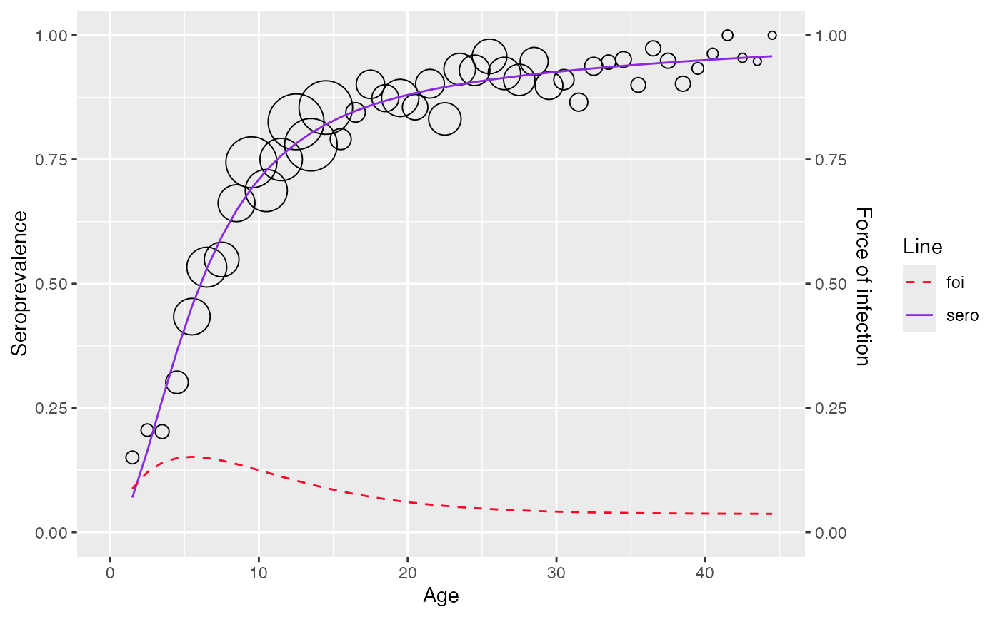
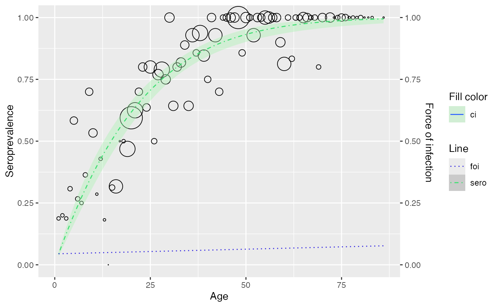

# Model visualization

``` r
library(serosv)
#> Warning: replacing previous import 'magrittr::extract' by 'tidyr::extract' when
#> loading 'serosv'
```

## Visualize model

To visualize the model, user can simply use function `plot`

``` r
hav <- hav_be_1993_1994
model <- fp_model(
  hav,
  p=c(1.5, 1.6), link="cloglog")
plot(model)
```


If implementation for confidence interval calculation is not yet
available, `plot` function would simply visualize seroprevalence line

``` r
rubella <- rubella_uk_1986_1987

farrington_md <- farrington_model(
   rubella,
   start=list(alpha=0.07,beta=0.1,gamma=0.03)
   )
plot(farrington_md)
```



## Customize the plot

Function
[`set_plot_style()`](https://oucru-modelling.github.io/serosv/reference/set_plot_style.md)
is provided to customize some attributes of the plot.

Current modifiable attributes include color, linetype for
seroprevalence, foi and fill color for confidence interval

``` r
gf_model <- polynomial_model(hav_bg_1964, type = "Griffith")

# customize plot
plot(gf_model) +
  set_plot_style(
    sero = "#3de071",
    foi = "#2f22e0",
    ci = "#aaf2b2",
    foi_line = "dotted", 
    sero_line = "dotdash"
  )
#> Scale for colour is already present.
#> Adding another scale for colour, which will replace the existing scale.
#> Scale for linetype is already present.
#> Adding another scale for linetype, which will replace the existing scale.
#> Scale for fill is already present.
#> Adding another scale for fill, which will replace the existing scale.
```


