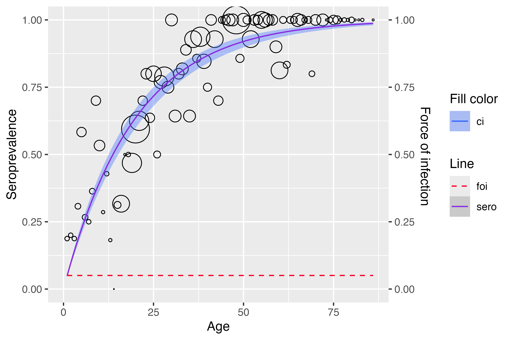
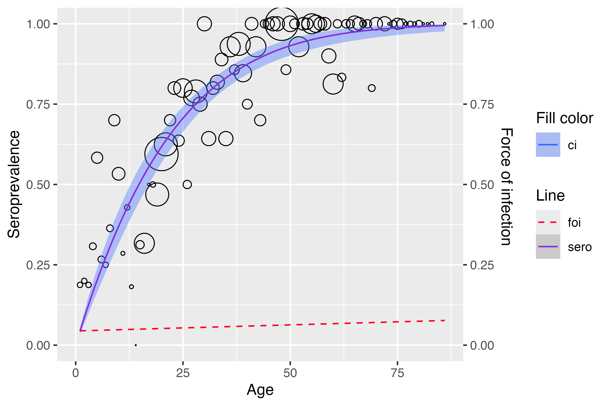
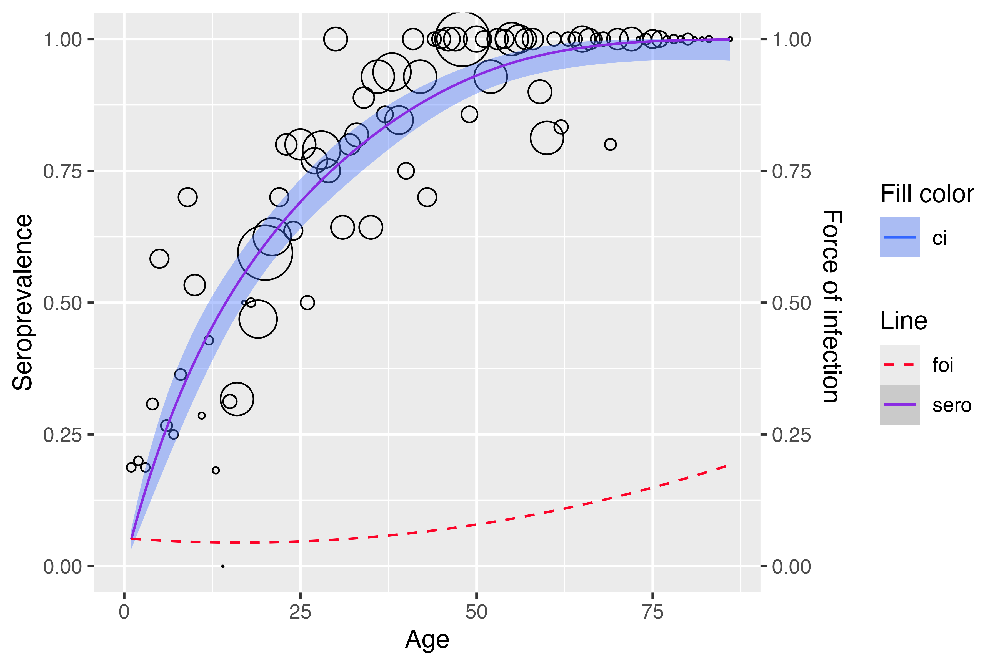
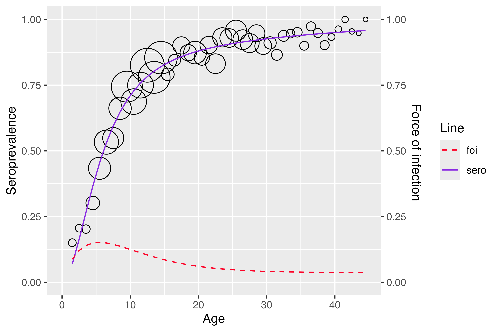
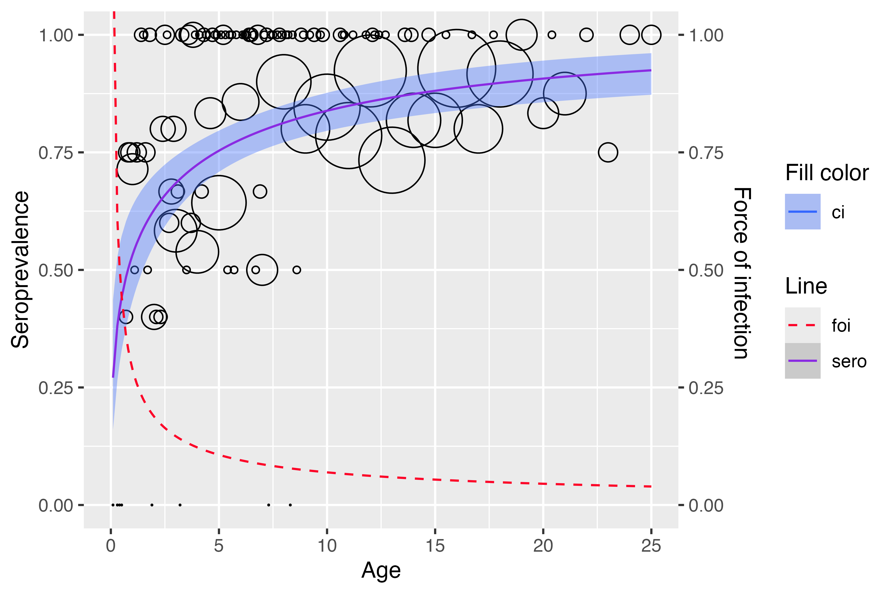
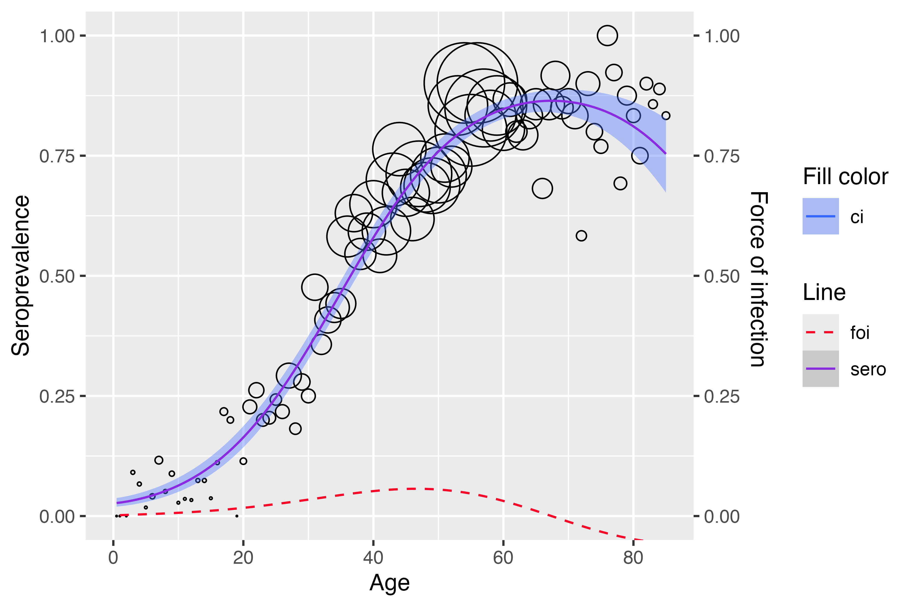
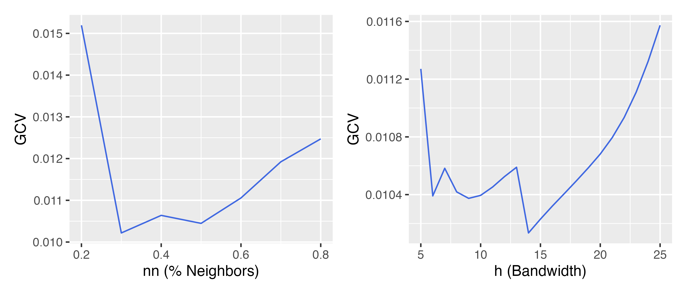
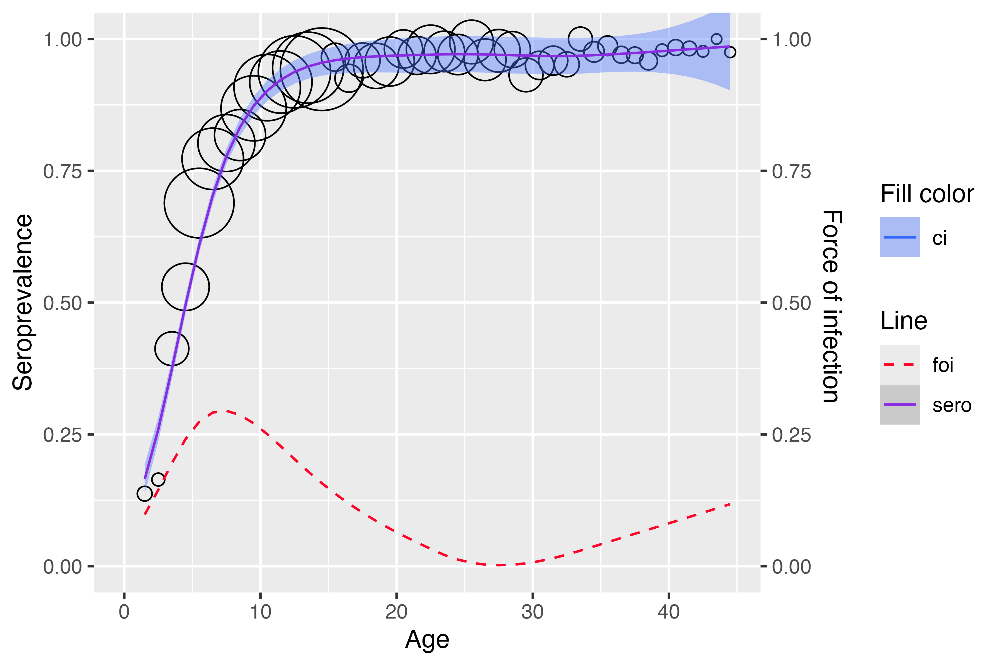
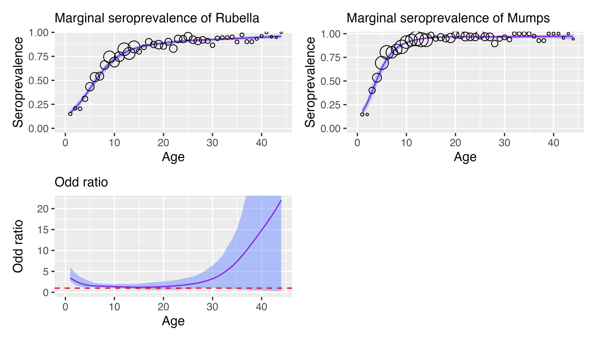

# serosv: model infectious disease parameters from serosurveys

Here we demonstrate how to use `serosv` to estimate the seroprevalence
and force of infection using some built-in datasets.

## Polynomial models

Refer to `Chapter 6.1.1`

Use
[`polynomial_model()`](https://oucru-modelling.github.io/serosv/reference/polynomial_model.md)
to fit a polynomial model.

We will use the `Hepatitis A` data from Belgium 1993–1994 for this
example.

``` r
a <- hav_bg_1964
neg <- a$tot -a$pos
pos <- a$pos
age <- a$age
tot <- a$tot
```

### Muench model

**Muench**’s model can be estimated by either defining `k = 1` (a degree
one linear predictor) or setting the `type = "Muench"`.

``` r
muench1 <- polynomial_model(age, pos, neg, k = 1)
summary(muench1$info)
#> 
#> Call:
#> glm(formula = age(k), family = binomial(link = "log"), data = df)
#> 
#> Coefficients:
#>      Estimate Std. Error z value Pr(>|z|)    
#> Age -0.050500   0.002457  -20.55   <2e-16 ***
#> ---
#> Signif. codes:  0 '***' 0.001 '**' 0.01 '*' 0.05 '.' 0.1 ' ' 1
#> 
#> (Dispersion parameter for binomial family taken to be 1)
#> 
#>     Null deviance:    Inf  on 83  degrees of freedom
#> Residual deviance: 97.275  on 82  degrees of freedom
#> AIC: 219.19
#> 
#> Number of Fisher Scoring iterations: 5

muench2 <- polynomial_model(age, pos, neg, type = "Muench")
summary(muench2$info)
#> 
#> Call:
#> glm(formula = age(k), family = binomial(link = "log"), data = df)
#> 
#> Coefficients:
#>      Estimate Std. Error z value Pr(>|z|)    
#> Age -0.050500   0.002457  -20.55   <2e-16 ***
#> ---
#> Signif. codes:  0 '***' 0.001 '**' 0.01 '*' 0.05 '.' 0.1 ' ' 1
#> 
#> (Dispersion parameter for binomial family taken to be 1)
#> 
#>     Null deviance:    Inf  on 83  degrees of freedom
#> Residual deviance: 97.275  on 82  degrees of freedom
#> AIC: 219.19
#> 
#> Number of Fisher Scoring iterations: 5
```

We can plot any model with the
[`plot()`](https://rdrr.io/r/graphics/plot.default.html) function.

``` r
plot(muench2) 
```



### Griffith model

Similarly, we can estimate **Griffith**’s model.

``` r
gf_model <- polynomial_model(age, pos, neg, type = "Griffith")
plot(gf_model)
```



### Grenfell and Anderson model

And Grenfell and Anderson’s model.

``` r
grf_model <- polynomial_model(age,pos,neg,type = "Grenfell")
plot(grf_model)
```



## Nonlinear models

Refer to `Chapter 6.1.2`

### Farrington model

Use
[`farrington_model()`](https://oucru-modelling.github.io/serosv/reference/farrington_model.md)
to fit a **Farrington**’s model.

``` r
rubella <- rubella_uk_1986_1987
rubella$neg <- rubella$tot - rubella$pos

farrington_md <- farrington_model(
   rubella$age, rubella$pos, rubella$tot,
   start=list(alpha=0.07,beta=0.1,gamma=0.03)
   )
plot(farrington_md)
```



### Weibull model

Use
[`weibull_model()`](https://oucru-modelling.github.io/serosv/reference/weibull_model.md)
to fit a Weibull model.

``` r
hcv <- hcv_be_2006[order(hcv_be_2006$dur), ]
dur <- hcv$dur
infected <- hcv$seropositive

wb_md <- weibull_model(
   t = dur,
   spos = infected
   )
plot(wb_md) 
```



## Fractional polynomial model

Refer to `Chapter 6.2`

Use
[`find_best_fp_powers()`](https://oucru-modelling.github.io/serosv/reference/find_best_fp_powers.md)
to find the powers which gives the lowest deviance score

``` r
hav <- hav_be_1993_1994
best_p <- find_best_fp_powers(
  hav$age, hav$pos, hav$tot,
  p=seq(-2,3,0.1), mc=FALSE, degree=2, link="cloglog"
)
best_p
#> $p
#> [1] 1.5 1.6
#> 
#> $deviance
#> [1] 81.60333
#> 
#> $model
#> 
#> Call:  glm(formula = as.formula(formulate(p_cur)), family = binomial(link = link))
#> 
#> Coefficients:
#> (Intercept)   I(age^1.5)   I(age^1.6)  
#>    -3.61083      0.12443     -0.07656  
#> 
#> Degrees of Freedom: 85 Total (i.e. Null);  83 Residual
#> Null Deviance:       1320 
#> Residual Deviance: 81.6  AIC: 361.2
```

Use
[`fp_model()`](https://oucru-modelling.github.io/serosv/reference/fp_model.md)
to fit a fractional polynomial model

``` r
model <- fp_model(
  hav$age, hav$pos, hav$tot,
  p=c(1.5, 1.6), link="cloglog")
plot(model)
```



## Nonparametric model

Refer to `Chapter 7.1`

### Local estimation by polynomial

``` r
mump <- mumps_uk_1986_1987
age <- mump$age
pos <- mump$pos
tot <- mump$tot
y <- pos/tot
```

Use
[`plot_gcv()`](https://oucru-modelling.github.io/serosv/reference/plot_gcv.md)
to show GCV curves for the nearest neighbor method (left) and constant
bandwidth (right).

``` r
plot_gcv(
   age, pos, tot,
   nn_seq = seq(0.2, 0.8, by=0.1),
   h_seq = seq(5, 25, by=1)
 )
```



Use
[`lp_model()`](https://oucru-modelling.github.io/serosv/reference/lp_model.md)
to fit a local estimation by polynomials.

``` r
lp <- lp_model(age, pos, tot, kern="tcub", nn=0.7, deg=2)
plot(lp)
```



## Semiparametric models

### Penalized likelihood

### Generalized likelihood framework

## Hierarchical Bayesian model

## Fitting quantitative data

## Modeling Multivariate serological data

Fitting bivariate Dale model using
[`bivariate_dale_model()`](https://oucru-modelling.github.io/serosv/reference/bivariate_dale_model.md)

We will use `rubella_mumps_uk` data for this example

``` r
data <- rubella_mumps_uk
model <- bivariate_dale_model(age = data$age, y = data[, c("NN", "NP", "PN", "PP")], monotonized=TRUE)
```

plot function for `bivariate_dale_model` object takes 3 additional
parameters:

- `y1` and `y2` are labels for 2 diseases being modeled

- `plot_type` is for the type of plot being returned

  - `"ci"` returns fitted line for marginal prevalence and its 95%
    confidence interval

  - `"sp"` returns conditional and joint seroprevalence and FOI

  - other inputs would returns all individual plots

``` r
plot(model, y1 = "Rubella", y2 = "Mumps", plot_type = "ci")
```



For line listing data `vzv_parvo_be` , use
[`generate_quad_matrix()`](https://oucru-modelling.github.io/serosv/reference/generate_quad_matrix.md)
function to create the (NN, NP, PN, PP) for fitting the model

``` r
generate_quad_matrix(vzv_parvo_be, vzv_res, parvo_res, age, discrete_age = F)
```

## Estimating Age-Time Dependent Prevalence
