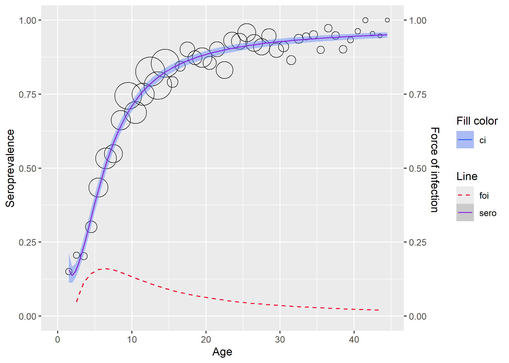
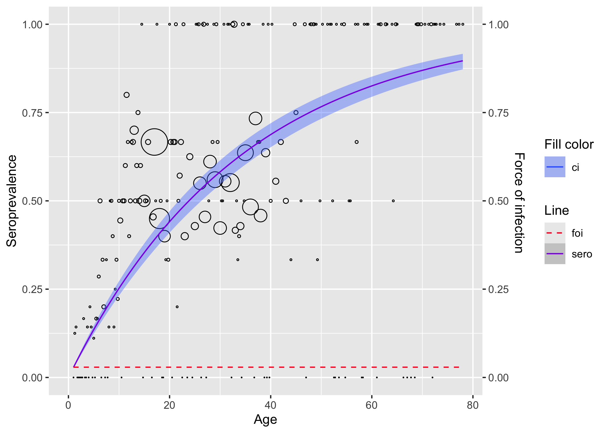
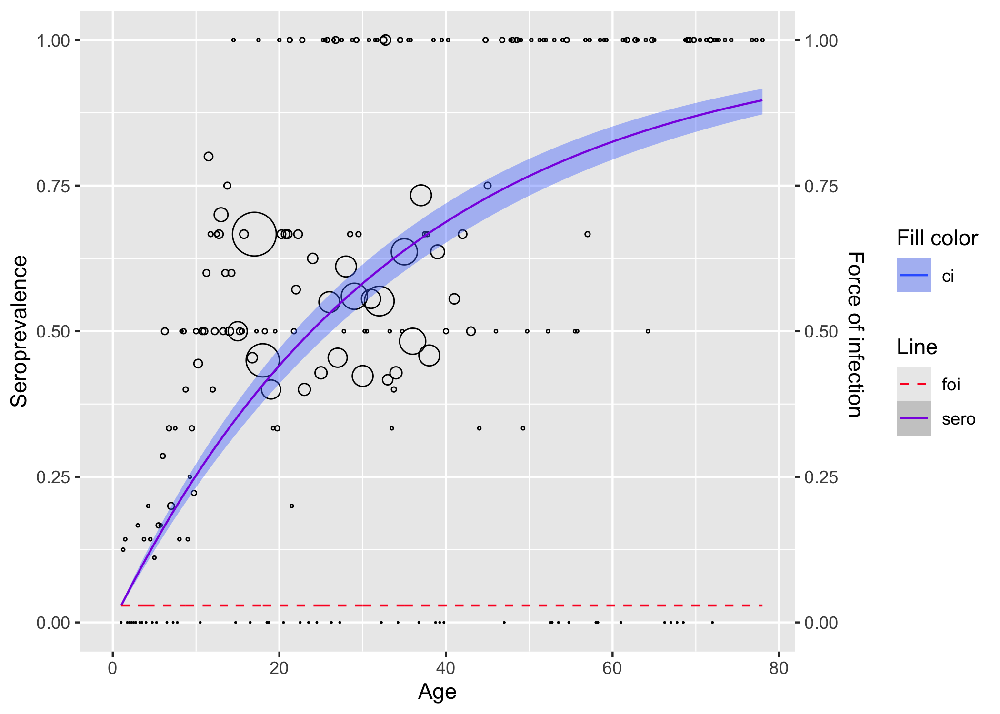

# serosv

`serosv` is an easy-to-use and efficient tool to estimate infectious
diseases parameters (seroprevalence and force of infection) using
serological data. The current version is mostly based on the book
“Modeling Infectious Disease Parameters Based on Serological and Social
Contact Data – A Modern Statistical Perspective” by [Hens et al., 2012
Springer](https://link.springer.com/book/10.1007/978-1-4614-4072-7).

## Installation

You can install the development version of serosv with:

``` r
# install.packages("devtools")
devtools::install_github("OUCRU-Modelling/serosv")
```

## Feature overview

### Datasets

`serosv` contains 15 built-in serological datasets as provided by [Hens
et al., 2012
Springer](https://link.springer.com/book/10.1007/978-1-4614-4072-7).
Simply call the name to load a dataset, for example:

``` r
rubella <- rubella_uk_1986_1987
```

### Methods

The following methods are available to estimate seroprevalence and force
of infection.

Parametric approaches:

- Frequentist methods:

  - Polynomial models:

    - Muench’s model
    - Griffiths’ model
    - Grenfell and Anderson’s model

  - Nonlinear models:

    - Farrington’s model
    - Weibull model

  - Fractional polynomial models

- Bayesian methods:

  - Hierarchical Farrington model

  - Hierarchical log-logistic model

Nonparametric approaches:

- Local estimation by polynomials

Semiparametric approaches:

- Penalized splines:

  - Penalized likelihood framework

  - Generalized Linear Mixed Model framework

## Demo

### Fitting rubella data from the UK

Load the rubella in UK dataset.

``` r
library(serosv)
rubella <- rubella_uk_1986_1987
```

Fit the data using a fractional polynomial model via
[`fp_model()`](https://oucru-modelling.github.io/serosv/reference/fp_model.md).
In this example, the model searches for the best combination of powers
within a specified range.

``` r
rubella_mod <- fp_model(
  rubella,
  p=list(
    p_range=seq(-2,3,0.1), # range of powers to search over
    degree=2 # maximum degree for the search
  ), 
  monotonic = T, # enforce model to be monotonic
  link="logit"
)
rubella_mod
#> Fractional polynomial model 
#> 
#> Input type:  aggregated 
#> Powers:  -0.9, -0.9 
#> 
#> Call:  glm(formula = as.formula(formulate(curr_p)), family = binomial(link = link))
#> 
#> Coefficients:
#>               (Intercept)                I(age^-0.9)  
#>                     4.342                     -4.696  
#> I(I(age^-0.9) * log(age))  
#>                    -9.845  
#> 
#> Degrees of Freedom: 43 Total (i.e. Null);  41 Residual
#> Null Deviance:       1369 
#> Residual Deviance: 37.58     AIC: 210.1
```

Visualize the model

``` r
plot(rubella_mod)
```



### Fitting Parvo B19 data from Finland

``` r
library(dplyr)
parvob19 <- parvob19_fi_1997_1998

# for linelisting data, either transform it to aggregated
transform_data(
  parvob19$age, 
  parvob19$seropositive,
  stratum_col = "age") |>
  polynomial_model(k = 1) |>
  plot()
```



``` r

# or fit data as is
parvob19 |>
  rename(status = seropositive) |>
  polynomial_model(k = 1) |>
  plot()
```


